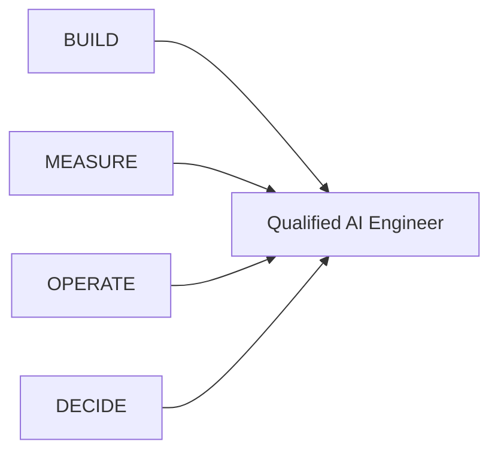
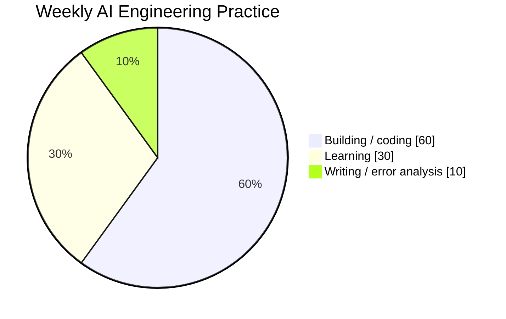

# AI Engineer Roadmap — From LLM Foundations to Production AI Systems

[中文 README](README.zh-CN.md)

A bilingual, production-oriented roadmap for becoming a qualified **AI Engineer / Applied AI Engineer / LLM Engineer / Agent Engineer**.

This repository starts from Andrew Ng's 2026 AI Engineering Skills Map and expands it into a hands-on engineering curriculum with architecture diagrams, evaluation methodology, security, production operations, portfolio projects and a 24-week execution plan.

## What “qualified AI Engineer” means here



- **BUILD** reliable LLM/RAG/agent systems.
- **MEASURE** behavior with evals and error analysis.
- **OPERATE** them in production.
- **DECIDE** what to build and defend the trade-offs.

## Repository structure

```text
.
├── README.md
├── README.zh-CN.md
└── docs
    ├── en
    │   └── 00...18
    └── zh-CN
        └── 00...18
```

Every chapter has an English and Chinese counterpart. Chinese chapters deliberately preserve common professional English terms instead of forcing unnatural translations.

## Reading order

| # | English | 中文 |
|---:|---|---|
| 1 | [How to Read and Use This Roadmap](docs/en/00-reading-guide.md) | [如何阅读与使用这套路线](docs/zh-CN/00-reading-guide.md) |
| 2 | [Andrew Ng's AI Engineering Skills Map — Detailed Analysis](docs/en/01-andrew-ng-analysis.md) | [Andrew Ng AI Engineering Skills Map — 详细拆解](docs/zh-CN/01-andrew-ng-analysis.md) |
| 3 | [AI Engineer Competency Map](docs/en/02-ai-engineer-skill-map.md) | [AI Engineer 能力地图](docs/zh-CN/02-ai-engineer-skill-map.md) |
| 4 | [LLM Foundations](docs/en/03-llm-foundations.md) | [LLM Foundations：大模型基础](docs/zh-CN/03-llm-foundations.md) |
| 5 | [Prompt & Context Engineering](docs/en/04-prompt-context-engineering.md) | [Prompt & Context Engineering：提示词与上下文工程](docs/zh-CN/04-prompt-context-engineering.md) |
| 6 | [Grounding, Retrieval and RAG](docs/en/05-grounding-rag.md) | [Grounding、Retrieval 与 RAG](docs/zh-CN/05-grounding-rag.md) |
| 7 | [Agentic Systems Engineering](docs/en/06-agentic-systems.md) | [Agentic Systems Engineering：智能体系统工程](docs/zh-CN/06-agentic-systems.md) |
| 8 | [Evaluation-Driven Development](docs/en/07-evaluation-driven-development.md) | [Evaluation-Driven Development：评估驱动开发](docs/zh-CN/07-evaluation-driven-development.md) |
| 9 | [Production AI and LLMOps](docs/en/08-production-llmops.md) | [Production AI 与 LLMOps](docs/zh-CN/08-production-llmops.md) |
| 10 | [Machine Learning Foundations](docs/en/09-machine-learning-foundations.md) | [Machine Learning Foundations：机器学习基础](docs/zh-CN/09-machine-learning-foundations.md) |
| 11 | [Software Engineering Foundations](docs/en/10-software-engineering-foundations.md) | [Software Engineering Foundations：软件工程底座](docs/zh-CN/10-software-engineering-foundations.md) |
| 12 | [Engineering with Coding Agents](docs/en/11-coding-agents.md) | [Engineering with Coding Agents：使用编程智能体](docs/zh-CN/11-coding-agents.md) |
| 13 | [Shaping the Build and Product Judgment](docs/en/12-shaping-the-build.md) | [Shaping the Build：产品判断与工程决策](docs/zh-CN/12-shaping-the-build.md) |
| 14 | [AI Security & Safety Engineering](docs/en/13-ai-security-safety.md) | [AI Security & Safety Engineering：AI 安全工程](docs/zh-CN/13-ai-security-safety.md) |
| 15 | [24-Week Execution Plan](docs/en/14-24-week-plan.md) | [24 周执行路线](docs/zh-CN/14-24-week-plan.md) |
| 16 | [Portfolio and Capstone Projects](docs/en/15-portfolio-projects.md) | [Portfolio 与 Capstone Projects](docs/zh-CN/15-portfolio-projects.md) |
| 17 | [Interview and Job-Readiness Rubric](docs/en/16-interview-readiness.md) | [面试与 Job-Readiness 评分标准](docs/zh-CN/16-interview-readiness.md) |
| 18 | [Learning Resources and References](docs/en/17-resources.md) | [学习资源与参考资料](docs/zh-CN/17-resources.md) |
| 19 | [AI Engineering Glossary and Common Expressions](docs/en/18-glossary.md) | [AI Engineering 术语与常用英文表达](docs/zh-CN/18-glossary.md) |

## How to use it

Start with the reading guide. Work sequentially through foundations → RAG/agents/evals → production/security → coding agents/product judgment. The 24-week plan turns the chapters into weekly deliverables.

Recommended time ratio:



## Completion standard

A chapter is not done because you finished reading it. It is done when you can:
1. explain the mental model;
2. implement the core mechanism;
3. build an eval;
4. diagnose failures;
5. defend trade-offs;
6. operate the system safely.

## Sources

Primary inspiration:
- Andrew Ng — https://www.andrewng.org/writing
- DeepLearning.AI / The Batch — https://www.deeplearning.ai/the-batch/

The roadmap also incorporates broader production AI engineering practices including context engineering, RAG evaluation, agent reliability, LLMOps, AI security and coding-agent workflows.

## Status

This is designed as a living roadmap. AI APIs and frameworks will change; the engineering principles around measurement, systems, reliability, security and product judgment should remain much more durable.
