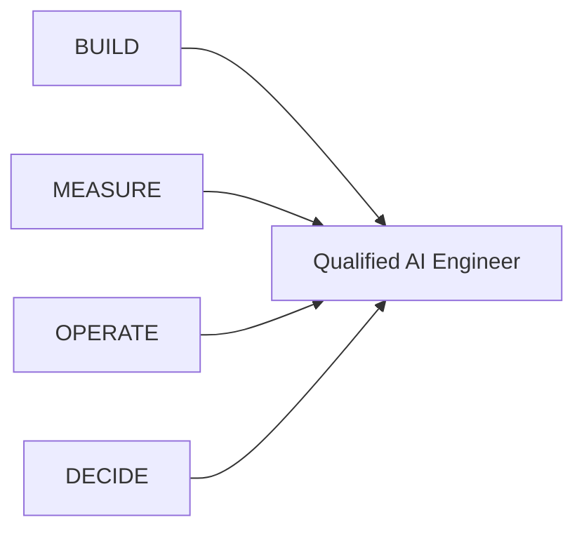
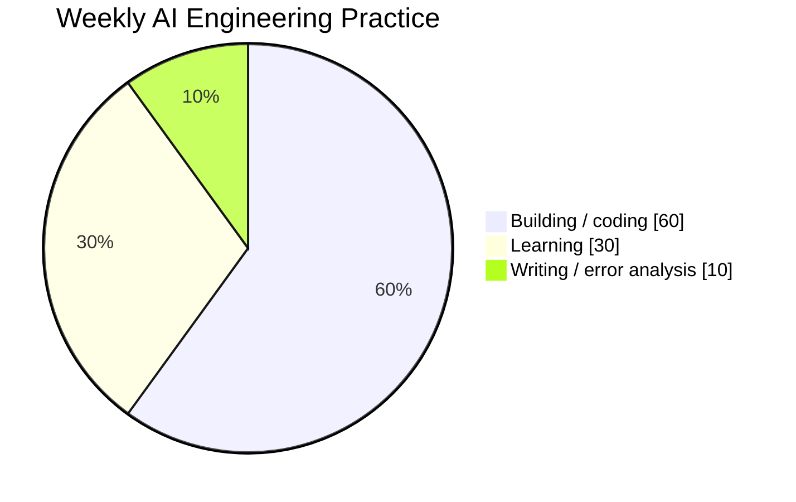

# AI Engineer Roadmap — 从 LLM Foundations 到 Production AI Systems

[English README](README.md)

这是一套中英文双语、面向 **production AI Engineering** 的系统路线，目标岗位包括 **AI Engineer / Applied AI Engineer / LLM Engineer / Agent Engineer**。

路线以 Andrew Ng 2026 年 AI Engineering Skills Map 为起点，再扩展到完整的 hands-on engineering curriculum：LLM、Prompt/Context、RAG、Agents、Evals、Production/LLMOps、Security、Coding Agents、Product Judgment、Portfolio 和 24 周执行计划。

## 这里如何定义 qualified AI Engineer



- **BUILD** — 能构建可靠的 LLM / RAG / Agent system。
- **MEASURE** — 能用 eval + error analysis 证明它是否有效。
- **OPERATE** — 能把系统放进 production 并长期运维。
- **DECIDE** — 能判断该做什么、如何做，并解释 trade-offs。

## Repo 结构

```text
.
├── README.md
├── README.zh-CN.md
└── docs
    ├── en
    │   └── 00...18
    └── zh-CN
        └── 00...18
```

每一篇文档都有 English / 中文一一对应版本。

中文版本会**主动保留行业中自然使用的英文词汇和表达**，例如：

- eval；
- grounding；
- tool calling；
- human-in-the-loop；
- error analysis；
- production readiness；
- fallback；
- rollout；
- blast radius。

这些词如果强行全部汉化，反而不利于真实工作、面试和阅读英文 docs。

## 阅读顺序

| # | 中文 | English |
|---:|---|---|
| 1 | [如何阅读与使用这套路线](docs/zh-CN/00-reading-guide.md) | [How to Read and Use This Roadmap](docs/en/00-reading-guide.md) |
| 2 | [Andrew Ng AI Engineering Skills Map — 详细拆解](docs/zh-CN/01-andrew-ng-analysis.md) | [Andrew Ng's AI Engineering Skills Map — Detailed Analysis](docs/en/01-andrew-ng-analysis.md) |
| 3 | [AI Engineer 能力地图](docs/zh-CN/02-ai-engineer-skill-map.md) | [AI Engineer Competency Map](docs/en/02-ai-engineer-skill-map.md) |
| 4 | [LLM Foundations：大模型基础](docs/zh-CN/03-llm-foundations.md) | [LLM Foundations](docs/en/03-llm-foundations.md) |
| 5 | [Prompt & Context Engineering：提示词与上下文工程](docs/zh-CN/04-prompt-context-engineering.md) | [Prompt & Context Engineering](docs/en/04-prompt-context-engineering.md) |
| 6 | [Grounding、Retrieval 与 RAG](docs/zh-CN/05-grounding-rag.md) | [Grounding, Retrieval and RAG](docs/en/05-grounding-rag.md) |
| 7 | [Agentic Systems Engineering：智能体系统工程](docs/zh-CN/06-agentic-systems.md) | [Agentic Systems Engineering](docs/en/06-agentic-systems.md) |
| 8 | [Evaluation-Driven Development：评估驱动开发](docs/zh-CN/07-evaluation-driven-development.md) | [Evaluation-Driven Development](docs/en/07-evaluation-driven-development.md) |
| 9 | [Production AI 与 LLMOps](docs/zh-CN/08-production-llmops.md) | [Production AI and LLMOps](docs/en/08-production-llmops.md) |
| 10 | [Machine Learning Foundations：机器学习基础](docs/zh-CN/09-machine-learning-foundations.md) | [Machine Learning Foundations](docs/en/09-machine-learning-foundations.md) |
| 11 | [Software Engineering Foundations：软件工程底座](docs/zh-CN/10-software-engineering-foundations.md) | [Software Engineering Foundations](docs/en/10-software-engineering-foundations.md) |
| 12 | [Engineering with Coding Agents：使用编程智能体](docs/zh-CN/11-coding-agents.md) | [Engineering with Coding Agents](docs/en/11-coding-agents.md) |
| 13 | [Shaping the Build：产品判断与工程决策](docs/zh-CN/12-shaping-the-build.md) | [Shaping the Build and Product Judgment](docs/en/12-shaping-the-build.md) |
| 14 | [AI Security & Safety Engineering：AI 安全工程](docs/zh-CN/13-ai-security-safety.md) | [AI Security & Safety Engineering](docs/en/13-ai-security-safety.md) |
| 15 | [24 周执行路线](docs/zh-CN/14-24-week-plan.md) | [24-Week Execution Plan](docs/en/14-24-week-plan.md) |
| 16 | [Portfolio 与 Capstone Projects](docs/zh-CN/15-portfolio-projects.md) | [Portfolio and Capstone Projects](docs/en/15-portfolio-projects.md) |
| 17 | [面试与 Job-Readiness 评分标准](docs/zh-CN/16-interview-readiness.md) | [Interview and Job-Readiness Rubric](docs/en/16-interview-readiness.md) |
| 18 | [学习资源与参考资料](docs/zh-CN/17-resources.md) | [Learning Resources and References](docs/en/17-resources.md) |
| 19 | [AI Engineering 术语与常用英文表达](docs/zh-CN/18-glossary.md) | [AI Engineering Glossary and Common Expressions](docs/en/18-glossary.md) |

## 如何执行

先从 Reading Guide 开始，再按：

`Foundations → RAG/Agents/Evals → Production/Security → Coding Agents/Product Judgment`

顺序学习。

24-week plan 把这些内容变成每周 deliverables。

建议时间比例：



## 学完的判断标准

不是“看完了”就算完成。

至少要能够：

1. explain the mental model；
2. implement the core mechanism；
3. build an eval；
4. diagnose failures；
5. defend trade-offs；
6. operate the system safely。

## 来源与致谢 / Source & Credits

这套 roadmap 的核心 skills-map framing 来源于 **Andrew Ng 2026 年发布的 AI Engineering Skills Map**，尤其是他对 **Building and Deploying AI Applications** 的进一步拆解：

- **Andrew Ng — 原始 X post（2026-08-21）：** [The AI Engineering Skills Map in Detail: Building and Deploying AI Applications](https://x.com/AndrewYNg/status/2090840747738374568)
- **DeepLearning.AI / The Batch — 对应详细文章：** [The AI Engineering Skills Map in Detail: Building and Deploying AI Applications](https://charonhub.deeplearning.ai/he-ai-engineering-skills-map-in-detail-building-and-deploying-ai-applications/)

原始 skills-map framework 的 credit 归于 **Andrew Ng 和 DeepLearning.AI**。本仓库是在该框架基础上独立整理和扩展的学习路线，进一步加入了 Context Engineering、RAG Evaluation、Agent Reliability、LLMOps、AI Security、Coding-Agent workflows、Portfolio projects 和 interview preparation 等 production AI Engineering 内容。本仓库不是 DeepLearning.AI 官方课程，也不代表 Andrew Ng 对本仓库全部扩展内容的 endorsement。

## Status

这是一个 living roadmap。API 和 framework 会快速变化；真正应该长期掌握的是 measurement、systems、reliability、security 与 product judgment。
