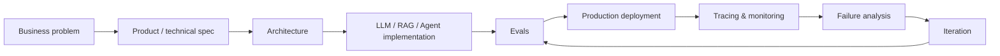
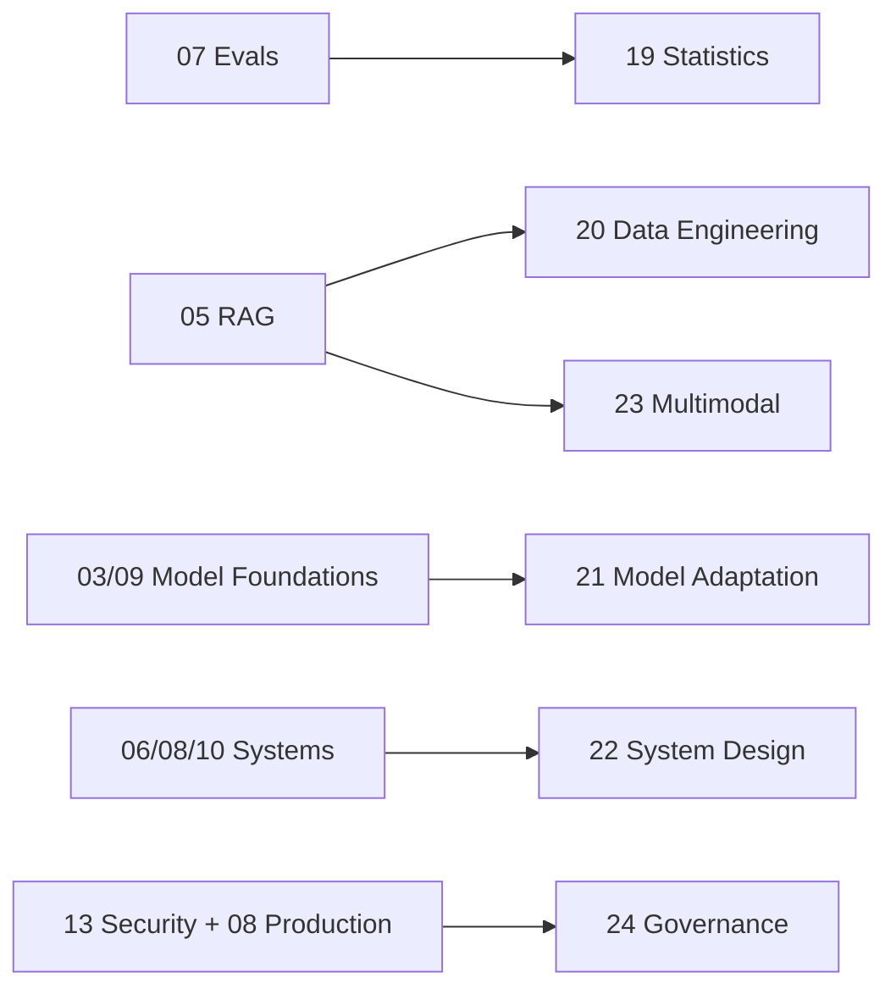

# How to Read and Use This Roadmap

[中文版本](../zh-CN/00-reading-guide.md)

This repository is a **production-oriented AI Engineering curriculum**, not a list of GenAI tutorials. It starts from Andrew Ng's 2026 AI Engineering Skills Map and expands it into an execution system for becoming job-ready.

## The target capability

A qualified AI Engineer should be able to own the complete loop:

The target is not “I know LangChain” or “I can call an LLM API.” The target is:

> I can turn probabilistic model behavior into a measurable, controllable, secure and maintainable software system.

## Recommended reading order

### Pass 1 — Build the mental model

1. Andrew Ng analysis
2. AI Engineer competency map
3. LLM foundations
4. Prompt & context engineering

### Pass 2 — Build AI systems

5. Grounding and RAG
6. Agentic systems
7. Evaluation-driven development

### Pass 3 — Make them production-grade

8. Production AI / LLMOps
9. ML foundations
10. Software engineering foundations
11. AI security & safety

### Pass 4 — Become an effective engineer

12. Coding agents
13. Shaping the build
14. 24-week execution plan
15. Portfolio projects
16. Interview readiness

Use resources and glossary continuously.

## Pass 5 — Advanced cross-cutting tracks

The core 00–18 sequence is enough to understand the main AI Engineering Skills Map. The following chapters add **second-layer production depth**. They are not additional headline categories from Andrew Ng; they make several cross-cutting responsibilities explicit.

| Track | Why it exists | Recommended timing |
|---|---|---|
| [Statistics for AI Evals & Experimentation](19-statistics-for-evals-experimentation.md) | Adds uncertainty, paired comparison, bootstrap, judge calibration and online experiments to evaluation-driven development | After chapter 07 |
| [AI Data Engineering & Feedback Loops](20-ai-data-engineering.md) | Expands “grounding with data” beyond vector search into freshness, lineage, structured data, ACLs and trace-to-eval data | After chapter 05 |
| [Model Adaptation & Fine-Tuning](21-model-adaptation-finetuning.md) | Teaches when to fine-tune, dataset design, LoRA/PEFT concepts, distillation and held-out evaluation | After chapters 03/09 |
| [AI System Design Patterns](22-ai-system-design-patterns.md) | Unifies router, RAG, workflow, bounded-agent, async-job, human-approval and failure-containment patterns | After chapters 06/08/10 |
| [Multimodal AI Systems](23-multimodal-ai-systems.md) | Extends application engineering to PDFs, images, charts, OCR, audio/video and modality-specific evals | After LLM/RAG foundations |
| [AI Governance & Model Risk](24-ai-governance-model-risk.md) | Adds risk classification, ownership, release evidence, auditability, change management and incident response | After security/production |

You do **not** need to master all six before applying for AI Engineer roles. Prioritize by target role:

- application / agent engineer: 19, 20, 22 are highest priority;
- ML-heavy applied AI: 19, 20, 21;
- enterprise / platform AI: 19, 20, 22, 24;
- document / voice / vision products: add 23 early;
- regulated or high-impact systems: 24 is mandatory depth.

## Suggested weekly allocation

- **30% learning** — papers, official docs, concepts.
- **60% building** — code, experiments, evals.
- **10% writing** — architecture notes, ADRs, failure analysis.

If 80% of your time is videos and tutorials, invert the ratio.

## Three passes through every topic

**Pass A — Recognition:** understand vocabulary and architecture.

**Pass B — Construction:** implement a minimal working system without relying entirely on an orchestration framework.

**Pass C — Productionization:** add evals, observability, security, cost/latency constraints and failure handling.

## Evidence of learning

Every module should produce at least one durable artifact:

- code;
- experiment;
- eval dataset;
- benchmark;
- architecture diagram;
- ADR;
- failure-analysis note;
- deployment;
- postmortem.

## Job-ready definition

You are approaching job-readiness when you can whiteboard and implement:

> “Build an enterprise AI assistant that uses private documents and business tools.”

and proactively cover requirements, model selection, context, retrieval, tools, state, evals, safety, observability, latency, cost, rollout, rollback and feedback loops.

---

[Andrew Ng's AI Engineering Skills Map — Detailed Analysis →](01-andrew-ng-analysis.md)
