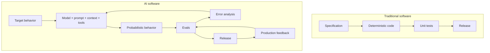
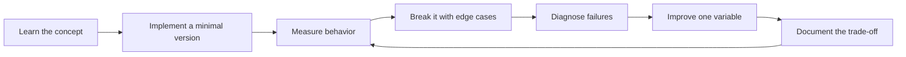

# Andrew Ng's AI Engineering Skills Map — Detailed Analysis

[中文版本](../zh-CN/01-andrew-ng-analysis.md)

## The source framework

Andrew Ng's August 2026 AI Engineering Skills Map groups modern AI engineering into four top-level capabilities:

1. **Building and deploying AI applications**
2. **Software engineering fundamentals**
3. **Using coding agents**
4. **Shaping the build**

A later detailed breakdown of building/deploying AI applications emphasizes:

- LLM foundations;
- grounding models with data;
- building agentic systems;
- evaluation-driven development;
- operating in production;
- machine learning foundations.

Continuous learning sits underneath all of them.

## What changed from classic software

The central engineering shift is that AI behavior is partly probabilistic. Therefore the “spec” increasingly becomes an eval suite plus operational constraints, not only deterministic requirements.

## The most important interpretation

The map is **not** a checklist of frameworks. It is a map of engineering responsibilities.

Weak signal:
- “I know LangGraph.”
- “I know a vector database.”
- “I can prompt GPT.”

Strong signal:
- “I can isolate retrieval failures from generation failures.”
- “I can quantify whether reranking improves end-to-end success.”
- “I can bound an agent's permissions and blast radius.”
- “I can detect regressions after a model or prompt change.”
- “I can decide when not to use an agent.”

## Why evals are a first-class engineering discipline

A demo-centric workflow is:

`prompt → inspect five examples → deploy`

A production workflow is:

`define target behavior → representative dataset → baseline → automated eval → failure taxonomy → error analysis → change → regression test → rollout → production feedback`

This is why **evaluation-driven development** should be treated as a central AI engineering skill rather than a testing afterthought.

## Why software engineering matters more, not less

Coding agents reduce implementation cost. That increases the relative value of architecture and judgment:

- interface design;
- data consistency;
- retries and idempotency;
- security boundaries;
- observability;
- rollout and rollback;
- maintainability.

The faster code is produced, the more damaging weak architectural judgment can become.

## Why “shaping the build” matters

As implementation becomes cheaper, engineering value moves upstream:

- Is this the right problem?
- What is the user outcome?
- What should the system refuse to do?
- What is the evaluation criterion?
- What is the cheapest architecture that meets the target?
- When should a human enter the loop?

## Expansion used in this repository

This roadmap adds explicit tracks for:

- Prompt & Context Engineering;
- AI security and prompt-injection defense;
- data lifecycle and ACL-aware retrieval;
- reliability patterns;
- cost and latency engineering;
- product metrics and human escalation.

These are necessary to convert the high-level map into a production-ready curriculum.

## Primary references

- Andrew Ng X post (2026-08-21): https://x.com/AndrewYNg/status/2090840747738374568
- DeepLearning.AI detailed article: https://www.deeplearning.ai/the-batch/he-ai-engineering-skills-map-in-detail-building-and-deploying-ai-applications
- Andrew Ng, Writing: https://www.andrewng.org/writing
- DeepLearning.AI, The Batch: https://www.deeplearning.ai/the-batch/

## How to study this chapter

Use the loop below instead of passive reading:

A chapter is **not complete** when you recognize the terminology. It is complete when you can build, measure, debug, and explain the relevant system without hiding behind a framework name.
---

[← How to Read and Use This Roadmap](00-reading-guide.md)  ·  [AI Engineer Competency Map →](02-ai-engineer-skill-map.md)
