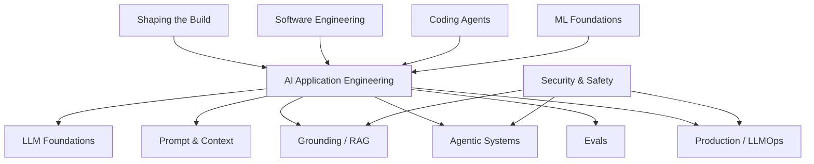
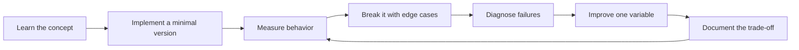

# AI Engineer Competency Map

[中文版本](../zh-CN/02-ai-engineer-skill-map.md)

## The full stack

## P0 — must-have skills

- one production backend language;
- APIs, async I/O, concurrency;
- LLM API integration;
- structured outputs;
- function/tool calling;
- embeddings;
- retrieval and RAG;
- eval design;
- error analysis;
- agent workflows;
- tracing and observability;
- containerization and cloud deployment;
- SQL/data modeling;
- Git and CI/CD;
- security fundamentals.

## P1 — strong differentiators

- hybrid retrieval and reranking;
- agent state and memory;
- human-in-the-loop;
- model routing and fallback;
- caching;
- prompt/model/version management;
- online/offline eval;
- judge calibration;
- cost/latency optimization;
- fine-tuning basics.

## P2 — role-dependent depth

- PyTorch;
- LoRA / QLoRA;
- distributed training;
- inference serving;
- GPU optimization;
- post-training methods;
- multimodal systems;
- advanced retrieval;
- self-hosted open-weight models.

## Four verbs that summarize the profession

**BUILD** — convert model capability into a product.

**MEASURE** — prove whether it works.

**OPERATE** — keep it reliable in production.

**DECIDE** — choose what to build and which trade-offs to accept.

An engineer with only BUILD skills is often a demo engineer. A mature AI Engineer develops all four.

## How to study this chapter

Use the loop below instead of passive reading:

A chapter is **not complete** when you recognize the terminology. It is complete when you can build, measure, debug, and explain the relevant system without hiding behind a framework name.
---

[← Andrew Ng's AI Engineering Skills Map — Detailed Analysis](01-andrew-ng-analysis.md)  ·  [LLM Foundations →](03-llm-foundations.md)
