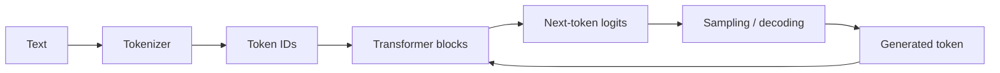
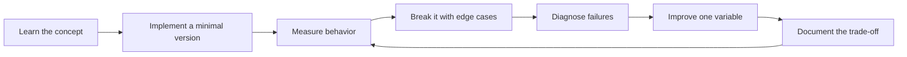

# LLM Foundations

[中文版本](../zh-CN/03-llm-foundations.md)

## Mental model

## What you need to understand

### Tokenization
Token is not the same as word. Token count affects context capacity, latency and cost. Compare tokenization for English, Chinese and code.

### Embeddings
Understand dense vectors, cosine similarity, dot product, nearest-neighbor search and why embedding similarity is useful but not equivalent to factual correctness.

### Transformer
You should explain self-attention, Q/K/V intuition, causal masking, multiple attention heads, MLP blocks, residual connections and positional information.

### Autoregressive generation
Understand logits, softmax, greedy decoding, sampling, temperature, top-p and stop conditions.

### Context window
System instructions, conversation history, retrieved documents, tool outputs and agent state all compete for a finite context budget.

### KV cache
At intermediate depth, understand why autoregressive decoding reuses prior K/V states and why long context changes serving memory and concurrency economics.

### Training lifecycle
Know the difference among pretraining, SFT, preference optimization, reinforcement-style post-training, distillation and fine-tuning.

## API-level competence

Be comfortable with at least two providers and with:
- synchronous and asynchronous calls;
- streaming;
- structured outputs;
- tool/function calling;
- multimodal input;
- timeouts and retries;
- rate limits;
- usage and cost accounting.

## Model-selection discipline

Do not ask “Which model is best?” Ask:

> Which model maximizes expected task value under quality, latency, cost, privacy and reliability constraints?

Build a model comparison table using the same eval dataset.

## Hands-on project

Build a **Structured Extraction Service** for support tickets, invoices or contracts.

Requirements:
- JSON schema;
- validation;
- retry/fallback;
- batch mode;
- token and latency metrics;
- a 100-case eval dataset.

## Definition of Done

You can explain the Transformer inference path, use structured outputs and tool calling, instrument token/cost/latency, and compare models with a repeatable eval rather than subjective preference.

## How to study this chapter

Use the loop below instead of passive reading:

A chapter is **not complete** when you recognize the terminology. It is complete when you can build, measure, debug, and explain the relevant system without hiding behind a framework name.
---

[← AI Engineer Competency Map](02-ai-engineer-skill-map.md)  ·  [Prompt & Context Engineering →](04-prompt-context-engineering.md)
