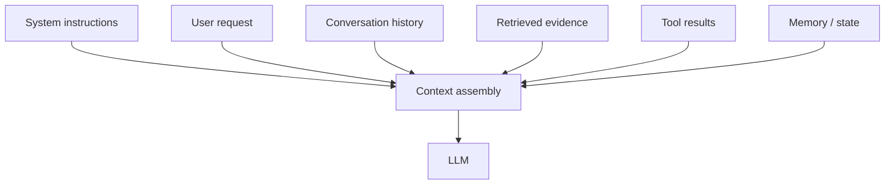
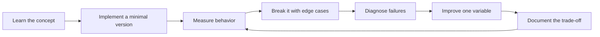

# Prompt & Context Engineering

[中文版本](../zh-CN/04-prompt-context-engineering.md)

Prompt engineering is only one part of context engineering.

## Core idea

A model's behavior depends heavily on what information is present, how it is structured and what has priority. A mature engineer therefore treats the entire context as a designed data structure.

## Prompt design

Practice:
- clear role and objective;
- explicit constraints;
- output schema;
- few-shot examples when useful;
- negative constraints only when necessary;
- separating instructions from untrusted data;
- deterministic post-validation instead of asking the model to “be careful.”

## Context budgeting

Measure:
- fixed instruction tokens;
- retrieved context tokens;
- history tokens;
- tool-output tokens;
- expected output tokens.

Avoid “context stuffing.” More context can reduce quality if it introduces irrelevant or conflicting evidence.

## Prompt versioning

Treat prompts as code:
- version them;
- review changes;
- attach eval results;
- roll back;
- keep prompt IDs in traces.

## Structured outputs

Prefer typed schemas whenever downstream software consumes the result. Validate with deterministic code. Never assume a model-generated JSON string is valid merely because the prompt requested JSON.

## Context failure modes

- instruction conflict;
- stale context;
- irrelevant context;
- duplicated evidence;
- missing evidence;
- prompt injection;
- tool result too large;
- conversation-history drift.

## Exercise

Take one extraction or support task and compare:
1. vague prompt;
2. explicit task contract;
3. structured output;
4. few-shot;
5. context compression;
6. eval-driven prompt iteration.

Do not optimize by intuition alone.

## How to study this chapter

Use the loop below instead of passive reading:

A chapter is **not complete** when you recognize the terminology. It is complete when you can build, measure, debug, and explain the relevant system without hiding behind a framework name.
---

[← LLM Foundations](03-llm-foundations.md)  ·  [Grounding, Retrieval and RAG →](05-grounding-rag.md)
