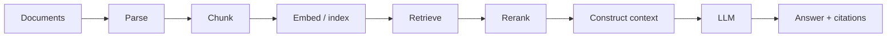
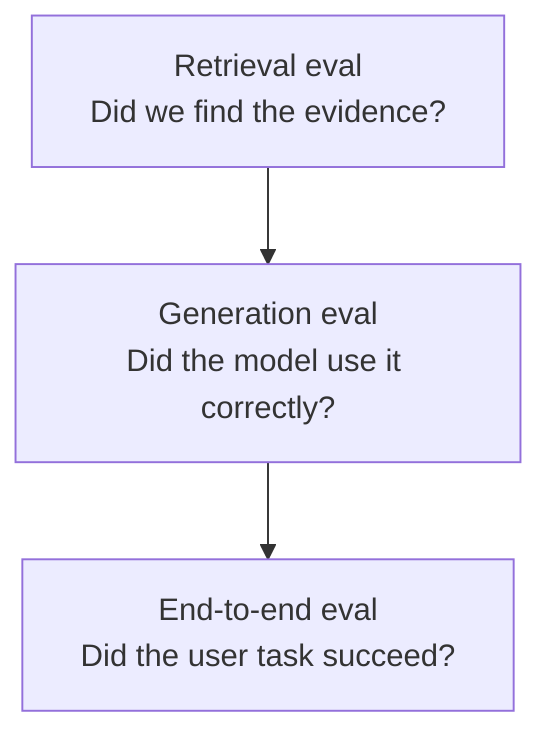
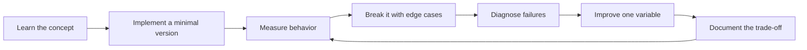

# Grounding, Retrieval and RAG

[中文版本](../zh-CN/05-grounding-rag.md)

## Canonical pipeline

## Ingestion
Handle identity, metadata, versioning, deduplication, timestamps, ACLs, updates and deletes. “We indexed the docs once” is not a production data strategy.

## Chunking
Compare fixed-token, paragraph, section-aware, semantic and parent-child chunking. Choose with retrieval evals rather than folklore.

## Retrieval
Learn dense/vector retrieval, sparse/BM25 retrieval, hybrid search, metadata filters, query rewriting and multi-query retrieval.

## Reranking
A common architecture retrieves a broad candidate set and then reranks it before context assembly. Measure retrieval and downstream answer quality separately.

## Evaluation layers

Metrics can include Recall@K, Precision@K, MRR/NDCG, correctness, faithfulness, completeness and citation accuracy.

## RAG vs long context vs fine-tuning

Use RAG when knowledge is dynamic/private/large and citations or ACLs matter.

Use long context when the corpus is small enough and global document relationships matter.

Use fine-tuning primarily to alter behavior or task patterns, not as the default method to “store facts.”

## Security
Retrieved content is untrusted data. Design for prompt injection, data leakage, tenant isolation and ACL-aware retrieval.

## Project
Build an Enterprise Knowledge Assistant with hybrid retrieval, reranking, citations, incremental indexing, ACL filtering, traceability and at least 100 evaluation questions.

## How to study this chapter

Use the loop below instead of passive reading:

A chapter is **not complete** when you recognize the terminology. It is complete when you can build, measure, debug, and explain the relevant system without hiding behind a framework name.
---

[← Prompt & Context Engineering](04-prompt-context-engineering.md)  ·  [Agentic Systems Engineering →](06-agentic-systems.md)
