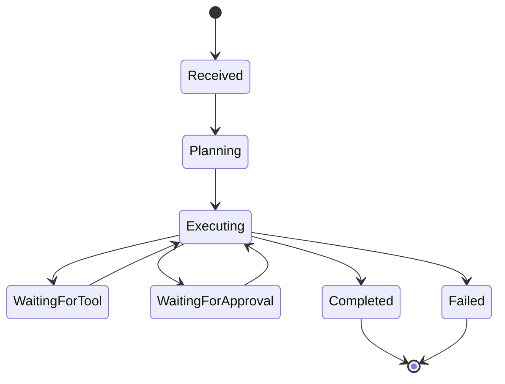
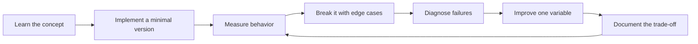

# Agentic Systems Engineering

[中文版本](../zh-CN/06-agentic-systems.md)

## Definition

An agent is a system in which a model participates in selecting actions based on goal, state and environment feedback.

## Learning sequence

1. typed tool calling;
2. single-agent loop;
3. explicit state;
4. planning when needed;
5. memory;
6. human-in-the-loop;
7. multi-agent only when decomposition justifies it.

## Workflow vs agent

Prefer deterministic code when the process is known and fixed. Use an agent when the path is genuinely difficult to predefine and environment feedback changes the next action.

A useful rule:

> If you can express the control flow clearly in normal code, prefer normal code.

## Tool design

Good tools are narrow, typed, observable and low-privilege. Avoid generic high-power tools such as unrestricted SQL or shell execution unless sandboxing and policy layers are deliberate.

## Reliability

Design for:
- max iterations;
- max token/cost budget;
- timeout/cancel;
- retry with backoff;
- checkpoints;
- idempotent side effects;
- dead-letter handling;
- fallback;
- human escalation.

## Evaluation

Measure outcome, trajectory, efficiency and safety:
- task success;
- correct tool choice;
- unnecessary steps;
- loop rate;
- recovery;
- token/tool cost;
- unauthorized-action rate.

## Project
Build an Operations Agent that searches internal docs, queries read-only APIs, drafts an action plan and creates tickets. Sensitive actions require approval and every step is traced.

## How to study this chapter

Use the loop below instead of passive reading:

A chapter is **not complete** when you recognize the terminology. It is complete when you can build, measure, debug, and explain the relevant system without hiding behind a framework name.
---

[← Grounding, Retrieval and RAG](05-grounding-rag.md)  ·  [Evaluation-Driven Development →](07-evaluation-driven-development.md)
