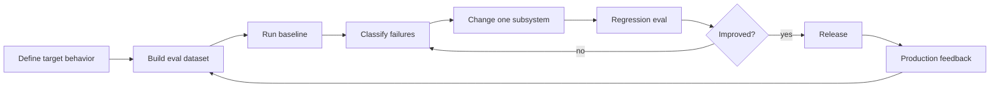
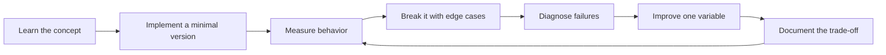

# Evaluation-Driven Development

[中文版本](../zh-CN/07-evaluation-driven-development.md)

## The core loop

## Golden datasets
Start with 30–50 examples and grow from real failures. Cover normal, edge, ambiguous, adversarial, long-input, missing-data and safety cases.

## Evaluator types

**Deterministic:** schema validity, exact fields, permissions, tool arguments, latency thresholds.

**Model-based:** correctness, relevance, completeness, faithfulness.

**Pairwise:** compare system A vs B.

**Human:** nuanced domain quality and calibration ground truth.

## LLM-as-judge
Use explicit rubrics, narrow criteria and human calibration. A judge model is another imperfect model, not an oracle.

## Error analysis
Group failures before changing the system. If most failures are retrieval failures, prompt polishing is probably not the highest-leverage work.

## Metrics
Track task quality together with cost and latency. A 2-point quality gain that triples cost may not be a product win.

## CI/CD
Run a small smoke eval on pull requests and a fuller evaluation suite periodically. Add every important production failure to the regression set.

## Key principle

> The eval suite gradually becomes the executable behavioral specification of the AI system.

## How to study this chapter

Use the loop below instead of passive reading:

A chapter is **not complete** when you recognize the terminology. It is complete when you can build, measure, debug, and explain the relevant system without hiding behind a framework name.
---

[← Agentic Systems Engineering](06-agentic-systems.md)  ·  [Production AI and LLMOps →](08-production-llmops.md)
