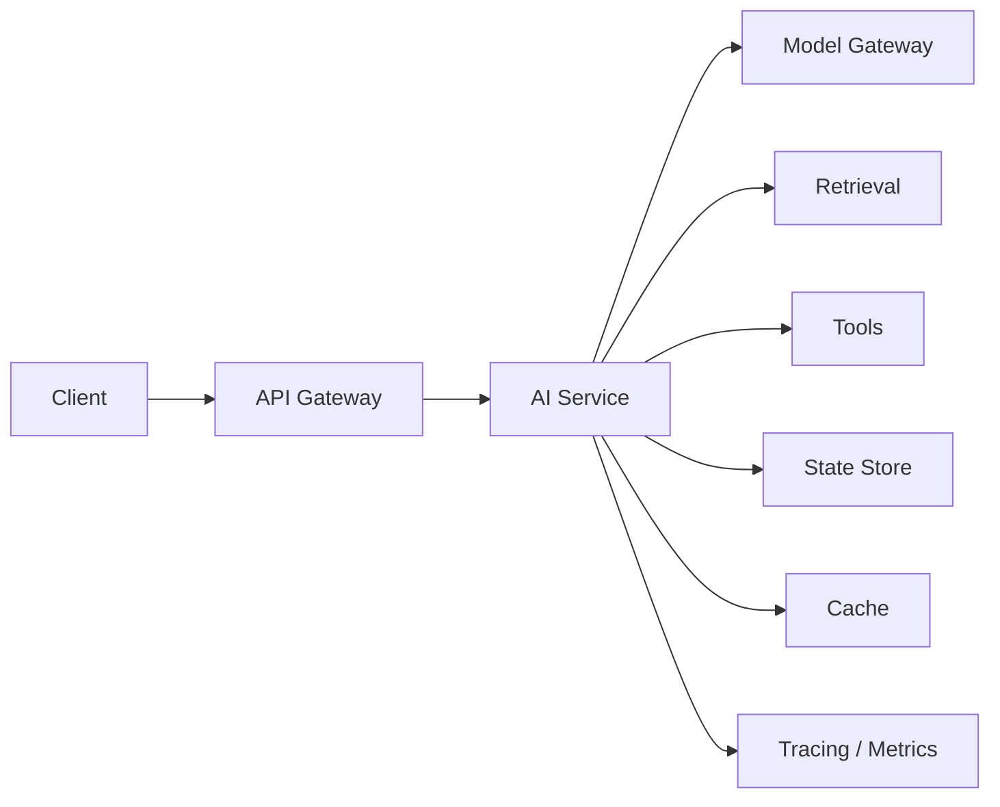
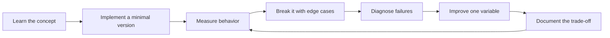

# Production AI and LLMOps

[中文版本](../zh-CN/08-production-llmops.md)

## Production architecture

## Observability
Record request IDs, user/tenant, model, prompt version, retrieval/index version, latency breakdown, token usage, cost, tool calls, errors, quality signals and user feedback.

## Reliability patterns
Use timeouts, bounded retries, exponential backoff, circuit breakers, fallbacks, idempotency, cancellation and human escalation.

## Cost engineering
Optimize **cost per successful task**, not merely token price. Use routing, smaller models, caching, context reduction, batching and fewer agent round trips.

## Latency engineering
Break latency into network, retrieval, model, tools and post-processing. Track p50/p95/p99 and exploit streaming, async I/O, parallel calls and caching where appropriate.

## Version everything
Model, prompt, embedding model, index, retrieval config, tool schema, policy and eval dataset should have identifiable versions.

## Rollout
Use shadow traffic, canary, A/B experiments and rollback. Model and prompt changes can produce regressions just like code changes.

## Drift
Watch provider behavior, user distribution, documents, policies and tool APIs. Sample production traffic into eval pipelines.

## Project
Deploy the RAG/agent project with authentication, rate limiting, secrets management, tracing, dashboards, fallback and rollback notes. Run a small load test and report p95 latency, failure rate and cost per successful task.

## How to study this chapter

Use the loop below instead of passive reading:

A chapter is **not complete** when you recognize the terminology. It is complete when you can build, measure, debug, and explain the relevant system without hiding behind a framework name.
---

[← Evaluation-Driven Development](07-evaluation-driven-development.md)  ·  [Machine Learning Foundations →](09-machine-learning-foundations.md)
