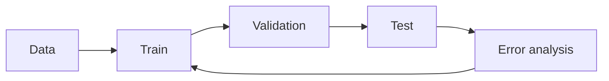

# Machine Learning Foundations

[中文版本](../zh-CN/09-machine-learning-foundations.md)

## Why AI Engineers still need ML
Foundation-model APIs do not remove the need to understand data distributions, train/validation/test separation, overfitting, metrics, uncertainty, optimization and fine-tuning.

## Core subjects
- supervised classification/regression;
- train/validation/test splits;
- precision, recall, F1, ROC-AUC, PR-AUC;
- bias/variance and generalization;
- mean/variance/distributions/conditional probability;
- confidence intervals and sampling intuition;
- gradient descent;
- neural networks and backpropagation;
- representation learning and embeddings.

## Fine-tuning decision
Before fine-tuning, ask:
1. Can prompting solve it?
2. Is missing context the real problem?
3. Is the workflow broken?
4. Does held-out evaluation show a persistent behavioral limitation?

Then consider SFT, PEFT, LoRA/QLoRA or other post-training approaches.

## Practice
Build one classical ML project with clean splits and error analysis, then one small fine-tuning experiment with a before/after held-out evaluation.

## How to study this chapter

Use the loop below instead of passive reading:

A chapter is **not complete** when you recognize the terminology. It is complete when you can build, measure, debug, and explain the relevant system without hiding behind a framework name.
---

[← Production AI and LLMOps](08-production-llmops.md)  ·  [Software Engineering Foundations →](10-software-engineering-foundations.md)
