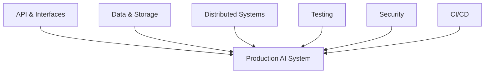
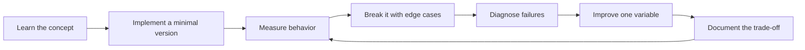

# Software Engineering Foundations

[中文版本](../zh-CN/10-software-engineering-foundations.md)

## Backend
Know HTTP, REST/RPC, authentication, serialization, schemas, async I/O and concurrency.

## Data systems
Know relational modeling, indexes, transactions, isolation, NoSQL trade-offs, caches and queues.

## Distributed systems
Understand partial failure, timeout, retry, backpressure, idempotency, at-least-once delivery, eventual consistency, rate limiting and circuit breakers.

## Testing
Use normal unit/integration/E2E tests **plus** AI evals. AI evals do not replace deterministic tests.

## Architecture
Be able to draw component diagrams, data flows, trust boundaries and state transitions and defend the trade-offs.

## CI/CD
A typical AI service pipeline:

`lint → unit tests → integration tests → AI eval smoke test → build → deploy`

## Coding-agent era
The faster agents generate code, the more valuable explicit interfaces, typed schemas, tests and architectural constraints become.

## How to study this chapter

Use the loop below instead of passive reading:

A chapter is **not complete** when you recognize the terminology. It is complete when you can build, measure, debug, and explain the relevant system without hiding behind a framework name.
---

[← Machine Learning Foundations](09-machine-learning-foundations.md)  ·  [Engineering with Coding Agents →](11-coding-agents.md)
