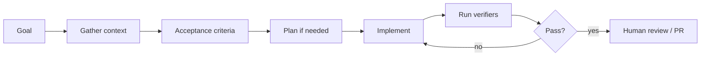

# Engineering with Coding Agents

[中文版本](../zh-CN/11-coding-agents.md)

## The real skill
Using a coding agent well is not “asking AI to write code.” It is delegating work with sufficient context, constraints and verifiers.

## Good task packet
Include:
- goal;
- relevant context;
- non-goals;
- architecture constraints;
- interfaces;
- acceptance criteria;
- verification commands.

## Planning
Use plan-first for large ambiguous changes. For small tasks, excessive planning adds latency and token cost.

## Verifiers
Give the agent compilers, tests, type checkers, linters, benchmarks and evals. An agent with strong verifiers can often close the loop autonomously.

## Safety
Use branches, sandboxes and least privilege. Do not expose production secrets or destructive infrastructure operations by default.

## Measure agent productivity
Track completion time, token/tool cost, defects and human interventions. “It felt faster” is not a serious productivity measurement.

## Practice
Take one real repository and complete feature work, refactoring and bug fixing with a repeatable agent workflow. Document the instructions that produced the best results.

## How to study this chapter

Use the loop below instead of passive reading:

A chapter is **not complete** when you recognize the terminology. It is complete when you can build, measure, debug, and explain the relevant system without hiding behind a framework name.
---

[← Software Engineering Foundations](10-software-engineering-foundations.md)  ·  [Shaping the Build and Product Judgment →](12-shaping-the-build.md)
