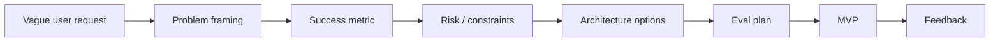
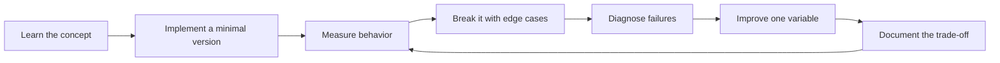

# Shaping the Build and Product Judgment

[中文版本](../zh-CN/12-shaping-the-build.md)

## Problem framing
A request such as “build an AI chatbot” is not a specification. Identify the actual job-to-be-done, current pain, user outcome and failure cost.

## AI use-case selection
Good candidates have a describable input/output, measurable feedback, manageable failure modes and clear business value.

Be cautious when actions are irreversible, high-stakes or lack a verification channel.

## AI feature spec
Include:
- goal;
- inputs/outputs;
- latency and cost constraints;
- privacy/security constraints;
- quality/eval criteria;
- failure behavior;
- escalation;
- non-goals.

## MVP judgment
Move fast for low-risk discovery. Slow down for money, production mutation, privacy, security, compliance or irreversible actions.

## Product metrics
Track task completion, time saved, correction rate, escalation rate, acceptance and cost per successful outcome — not only model accuracy.

## ADRs
For major choices, write an Architecture Decision Record:
`Context → Options → Trade-offs → Decision → Risks → Revisit trigger`.

## How to study this chapter

Use the loop below instead of passive reading:

A chapter is **not complete** when you recognize the terminology. It is complete when you can build, measure, debug, and explain the relevant system without hiding behind a framework name.
---

[← Engineering with Coding Agents](11-coding-agents.md)  ·  [AI Security & Safety Engineering →](13-ai-security-safety.md)
