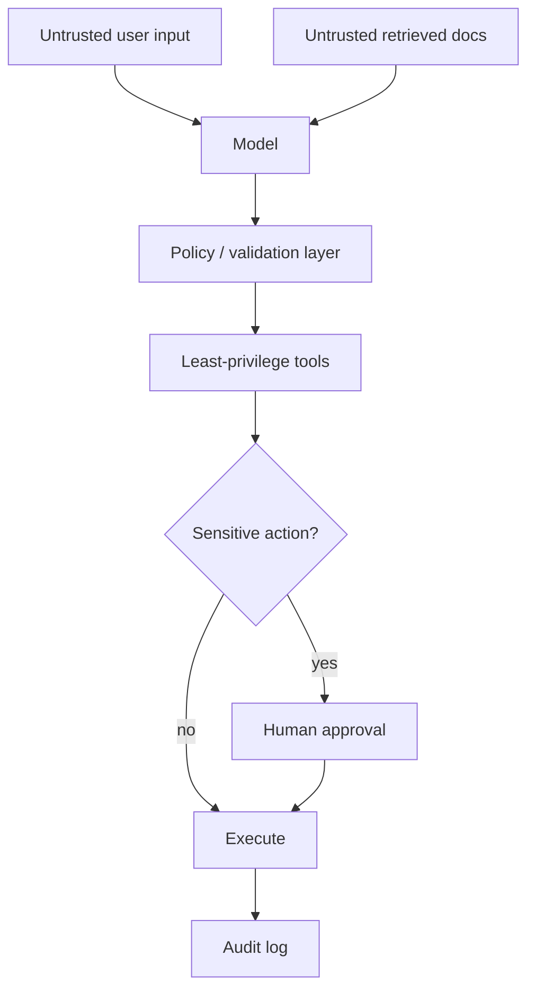
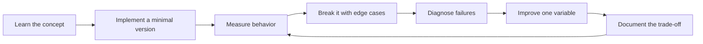

# AI Security & Safety Engineering

[中文版本](../zh-CN/13-ai-security-safety.md)

## Threat model

AI systems introduce familiar software risks plus model-specific attack surfaces:
- prompt injection;
- indirect prompt injection from retrieved content;
- data exfiltration;
- tool abuse;
- privilege escalation;
- unsafe code execution;
- SSRF;
- SQL injection;
- cross-tenant leakage;
- secret exposure.

## Core rule

> Treat model output as untrusted data, not as trusted executable instruction.

## Least privilege
Tools should expose only the minimum actions and data needed for the current task.

## Sandboxing
Shell, browser automation and arbitrary code execution should run in restricted environments with network/filesystem/resource controls.

## Approval gates
Irreversible or high-impact actions should require explicit approval.

## Retrieval security
Enforce ACL filters before data reaches the model. Do not rely on the model to “respect permissions.”

## Logging and privacy
Decide what prompts, retrieved documents, tool results and model outputs may be retained. Redact secrets/PII where appropriate.

## Security evals
Add adversarial cases for injection, privilege bypass, hidden instructions, malicious documents and unauthorized tool calls.

## How to study this chapter

Use the loop below instead of passive reading:

A chapter is **not complete** when you recognize the terminology. It is complete when you can build, measure, debug, and explain the relevant system without hiding behind a framework name.
---

[← Shaping the Build and Product Judgment](12-shaping-the-build.md)  ·  [24-Week Execution Plan →](14-24-week-plan.md)
