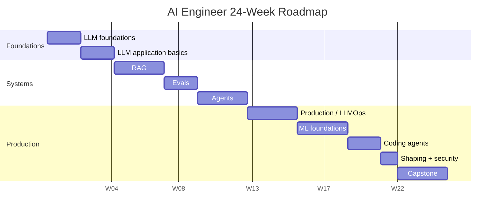
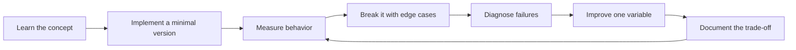

# 24-Week Execution Plan

[中文版本](../zh-CN/14-24-week-plan.md)

The dates are illustrative; follow the week sequence.

## Weeks 1–2 — LLM foundations
Tokens, embeddings, Transformer, generation, context. Implement tokenizer/embedding experiments and a tiny attention exercise.

## Weeks 3–4 — LLM application basics
Structured output, tool calling, streaming, async, retries. Build a Structured Extraction API.

## Weeks 5–7 — RAG
Chunking, indexing, hybrid retrieval, reranking, citations and retrieval eval. Build a Knowledge Assistant.

## Weeks 8–9 — Evals
Golden datasets, deterministic evaluators, LLM-as-judge, pairwise comparison, regression suite.

## Weeks 10–12 — Agents
Typed tools, state, bounded loops, HITL, checkpoints, idempotency and agent eval.

## Weeks 13–15 — Production
Deployment, auth, tracing, model gateway, cost/latency, fallback and rollout.

## Weeks 16–18 — ML foundations
Classical ML and a small fine-tuning experiment.

## Weeks 19–20 — Coding agents
Use a real repo. Measure time, defects, token cost and interventions.

## Week 21 — Shaping + security
Write a product/technical spec, threat model, architecture and eval plan before coding.

## Weeks 22–24 — Capstone
Build a production-grade enterprise research/data/operations copilot.

Every week must produce a code, eval, benchmark, diagram, ADR or failure-analysis artifact.

## How to study this chapter

Use the loop below instead of passive reading:

A chapter is **not complete** when you recognize the terminology. It is complete when you can build, measure, debug, and explain the relevant system without hiding behind a framework name.
---

[← AI Security & Safety Engineering](13-ai-security-safety.md)  ·  [Portfolio and Capstone Projects →](15-portfolio-projects.md)
