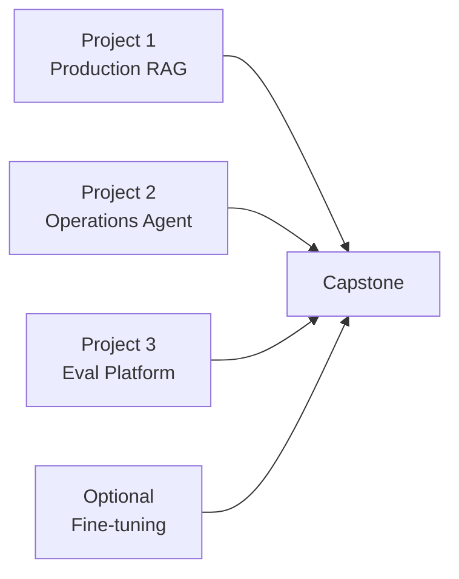
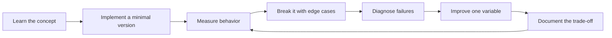

# Portfolio and Capstone Projects

[中文版本](../zh-CN/15-portfolio-projects.md)

## Project 1 — Production RAG Knowledge Assistant
Show ingestion, hybrid search, reranking, citations, ACLs, evals, tracing and production deployment.

## Project 2 — Tool-Using Operations Agent
Use typed tools, explicit state, HITL, idempotency, checkpoints, audit logs and agent evals.

## Project 3 — AI Evaluation Platform
Given dataset + prompt/model version, produce deterministic metrics, model-based grading, pairwise comparison, latency/cost and failure clusters.

This is a particularly strong engineering signal because measurement is central to reliable AI development.

## Optional Project 4 — Fine-tuning experiment
Compare base prompt, RAG and fine-tuned behavior with a held-out dataset. Explain when fine-tuning actually helped.

## Capstone
Build an Enterprise Research / Data / Operations Copilot combining retrieval, tools, agent state, approval, evals, tracing, security and deployment.

## README quality bar
Every serious project README should explain:
- problem;
- architecture;
- why AI;
- evaluation;
- baseline and improvements;
- failure analysis;
- production strategy;
- security;
- trade-offs.

A polished UI without evaluation evidence is weak portfolio signal.

## How to study this chapter

Use the loop below instead of passive reading:

A chapter is **not complete** when you recognize the terminology. It is complete when you can build, measure, debug, and explain the relevant system without hiding behind a framework name.
---

[← 24-Week Execution Plan](14-24-week-plan.md)  ·  [Interview and Job-Readiness Rubric →](16-interview-readiness.md)
