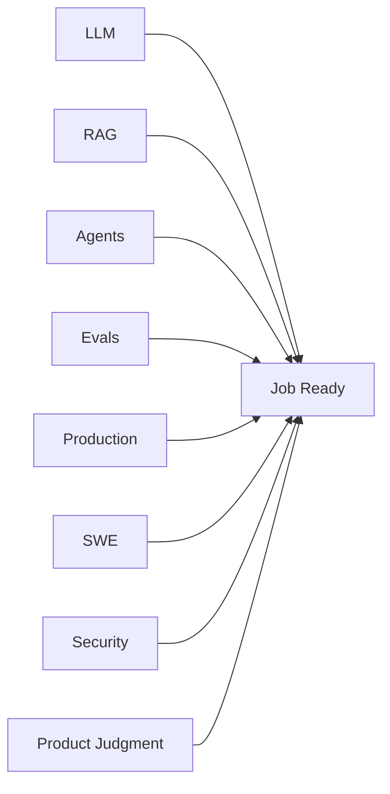
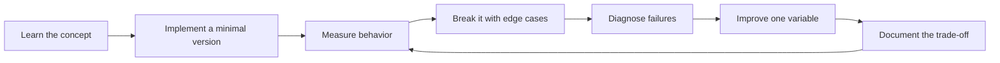

# Interview and Job-Readiness Rubric

[中文版本](../zh-CN/16-interview-readiness.md)

## Score yourself 0–3

- 0 — unfamiliar;
- 1 — can explain;
- 2 — have implemented;
- 3 — can independently design, debug and defend trade-offs.

## Core readiness bar
Aim for an average above 2.3, with no zero in P0 skills. Evals, production and software engineering should be at least 2.5 average.

## Interview themes

**LLM:** tokenization, context, sampling, model selection.

**RAG:** retrieval failure diagnosis, chunking, hybrid search, reranking, retrieval eval.

**Agents:** workflow vs agent, loop control, permissions, HITL, idempotency.

**Evals:** golden dataset, judge calibration, regression detection.

**Production:** provider outage, fallback, latency, cost, rollout, drift.

**Security:** prompt injection, tool abuse, ACLs, sandboxing.

**Product:** when not to use AI, acceptable failure rate, MVP scope.

## System-design readiness
You should be able to design an enterprise AI assistant and proactively cover:
requirements → architecture → model → retrieval → tools → state → evals → security → observability → cost/latency → rollout → feedback.

If your design is only “LLM + vector DB + framework,” keep training.

## How to study this chapter

Use the loop below instead of passive reading:

A chapter is **not complete** when you recognize the terminology. It is complete when you can build, measure, debug, and explain the relevant system without hiding behind a framework name.
---

[← Portfolio and Capstone Projects](15-portfolio-projects.md)  ·  [Learning Resources and References →](17-resources.md)
