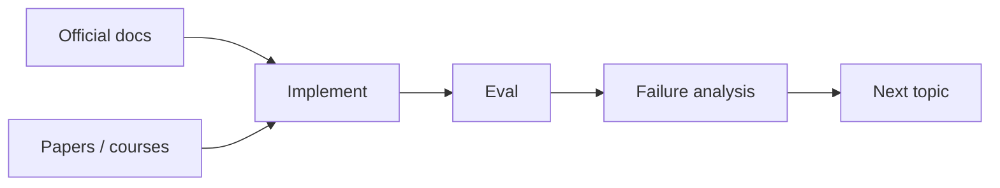

# Learning Resources and References

[中文版本](../zh-CN/17-resources.md)

## Andrew Ng / DeepLearning.AI
- https://www.andrewng.org/writing
- https://www.deeplearning.ai/the-batch/

## LLM foundations
- Hugging Face LLM Course: https://huggingface.co/learn/llm-course/
- Attention Is All You Need: https://arxiv.org/abs/1706.03762
- PyTorch tutorials: https://pytorch.org/tutorials/

## OpenAI
- Developer documentation: https://platform.openai.com/docs

Focus on model APIs, structured outputs, tools/agents, embeddings, evals and fine-tuning. APIs change; concepts last longer.

## Anthropic
- Documentation: https://docs.anthropic.com/

Study tool use, context engineering, agent patterns and coding-agent workflows.

## Agent orchestration
- LangChain / LangGraph documentation: https://docs.langchain.com/

First implement a small agent loop yourself. Then use a framework so you understand what abstraction it provides.

## Full Stack Deep Learning
- https://fullstackdeeplearning.com/

Useful for production ML/LLM systems, deployment and system thinking.

## Security
- OWASP GenAI / LLM security guidance: https://owasp.org/

## Learning rule
Prefer:
`concept → official docs → minimal implementation → real project → eval → error analysis`
over:
`course → course → course → course`.
---

[← Interview and Job-Readiness Rubric](16-interview-readiness.md)  ·  [AI Engineering Glossary and Common Expressions →](18-glossary.md)
