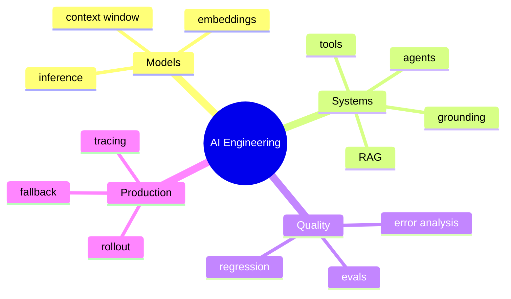

# AI Engineering Glossary and Common Expressions

[中文版本](../zh-CN/18-glossary.md)

## Terms

**Grounding** — providing external evidence or state so model outputs are anchored in relevant information.

**Retrieval-Augmented Generation (RAG)** — retrieval plus context augmentation plus generation.

**Tool calling / function calling** — a model emits a structured request for software to invoke an external capability.

**Human-in-the-loop (HITL)** — a workflow in which a human reviews, approves or corrects model actions.

**Evaluation-driven development** — treating measurable target behavior and evals as a core development loop.

**Error analysis** — categorizing failures to identify the highest-leverage subsystem to improve.

**Faithfulness / groundedness** — whether an answer is supported by supplied evidence.

**Least privilege** — granting only the minimum permissions necessary.

**Blast radius** — the maximum impact of a failure or compromised component.

**Canary rollout** — releasing to a small fraction of traffic before wider deployment.

**Fallback** — alternate behavior when the preferred model/tool/service is unavailable or unsafe.

## Common engineering expressions

- “Let’s establish a baseline first.”
- “We need to separate retrieval errors from generation errors.”
- “What is the failure mode?”
- “What is the blast radius?”
- “This needs a human approval gate.”
- “We should make this operation idempotent.”
- “Can we bound the agent’s tool permissions?”
- “What does the held-out eval say?”
- “This improved quality, but the latency trade-off is not acceptable.”
- “Let’s add this production failure to the regression set.”
- “We should prefer a deterministic workflow here.”
- “The model output should be treated as untrusted input.”
- “What is the cost per successful task?”
- “How do we roll this back?”
- “What would make us revisit this architecture decision?”
---

[← Learning Resources and References](17-resources.md)  
