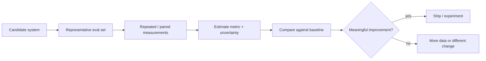

# Statistics for AI Evals and Experimentation

[中文版本](../zh-CN/19-statistics-for-evals-experimentation.md)

Andrew Ng's framing emphasizes using **statistical techniques to measure, steer, and govern AI systems**. This chapter adds the statistical layer that turns an eval from a score into evidence.

## Why this matters

A result such as `83% accuracy` is incomplete without knowing sample size, uncertainty, variance, data composition, and whether the comparison was paired.



## 1. Sampling and representativeness

An eval set is a sample from the task distribution you care about.

Learn to ask:

- What population is this eval intended to represent?
- Are common cases overrepresented while expensive failures are missing?
- Does production traffic contain segments absent from the benchmark?
- Are examples independent, or are many near-duplicates?
- Is the test set contaminated by prompt/model development?

Use stratification when important cohorts differ: language, document type, task complexity, customer tier, safety category, or tool path.

## 2. Point estimates are not enough

For every important metric, report:

- point estimate;
- sample size `n`;
- confidence interval or uncertainty estimate;
- segment breakdown where relevant.

For binary task success, a proportion confidence interval is more informative than a naked percentage. For non-normal or complicated metrics, bootstrap confidence intervals are often practical.

## 3. Paired comparisons

When comparing prompt/model/system A and B, run both on the **same examples** whenever possible.

Why: paired evaluation controls for example difficulty and makes the delta easier to estimate.

Track:

- wins for A;
- wins for B;
- ties;
- regressions on previously passing cases;
- improvements on previously failing cases.

A useful question is not only:

> Which system has the higher average score?

but:

> On which examples did behavior change, and are those changes concentrated in an important segment?

## 4. Repeated runs and model variance

LLM behavior can vary across runs, especially with sampling or agentic trajectories.

For stochastic tasks:

1. run the same case multiple times;
2. measure success-rate variance;
3. distinguish deterministic pipeline bugs from model variance;
4. consider pass@k or repeated-success metrics when appropriate.

Do not hide instability behind a single lucky run.

## 5. Bootstrap intuition

Bootstrap is useful when the analytic distribution of a metric is inconvenient.

Conceptually:

```text
original eval set
→ resample examples with replacement many times
→ recompute metric for each sample
→ inspect distribution of the metric/delta
→ estimate confidence interval
```

Implement a small bootstrap utility yourself. It is valuable for quality deltas, cost per task, latency, and composite metrics.

## 6. Statistical significance vs practical significance

A statistically detectable improvement may still be irrelevant to the product.

Always pair significance with an **effect-size / business threshold**:

```text
Ship only if:
quality delta >= minimum useful improvement
AND cost <= budget
AND p95 latency <= SLA
AND safety regression == 0 on critical cases
```

## 7. Human and model-judge agreement

If you use LLM-as-judge, evaluate the evaluator.

Measure against human-labeled examples:

- agreement rate;
- confusion matrix for categorical judgments;
- precision/recall on important failure labels;
- rank correlation for ordinal scores where appropriate;
- inter-rater agreement when multiple humans label the same examples.

Do not treat `judge_model = strong_model` as validation.

## 8. Threshold calibration

Thresholds should come from data, not aesthetics.

Examples:

- similarity threshold for retrieval;
- confidence threshold for auto-action vs escalation;
- judge score needed to pass a release gate;
- anomaly threshold for production monitoring.

Calibrate thresholds against the cost of false positives and false negatives.

## 9. A/B tests and online experiments

Offline eval answers whether a system appears better on a controlled dataset. Online experiments answer whether it improves real user outcomes.

Define before launching:

- primary metric;
- guardrail metrics;
- target population;
- randomization unit;
- minimum detectable effect;
- stopping rule;
- rollback condition.

Avoid repeatedly peeking at noisy results and stopping as soon as they look favorable.

## 10. Error bars for cost and latency

AI systems have variable latency and cost because inputs, outputs, tool calls, and agent paths vary.

Report distributions, not only averages:

- p50 / p95 / p99 latency;
- tokens per task distribution;
- cost per successful task;
- number of tool calls / agent steps.

## Hands-on exercise

Take an existing 100-case eval and compare two system versions.

Produce:

1. paired per-example results;
2. overall metric delta;
3. bootstrap 95% CI for the delta;
4. segment-level breakdown;
5. list of regressions;
6. quality/cost/latency decision table;
7. a written ship / do-not-ship recommendation.

## Definition of Done

You can:

- explain sampling bias and test contamination;
- report uncertainty instead of only point estimates;
- run paired comparisons;
- bootstrap a metric delta;
- measure stochastic variance;
- calibrate an LLM judge against humans;
- distinguish statistical from practical significance;
- design a basic A/B experiment;
- defend a release decision with evidence.

---

[← AI Engineering Glossary](18-glossary.md) · [AI Data Engineering →](20-ai-data-engineering.md)
