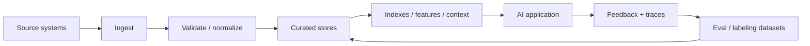

# AI Data Engineering and Feedback Loops

[中文版本](../zh-CN/20-ai-data-engineering.md)

Grounding an AI system with data is broader than vector search. Production AI systems depend on pipelines that make data **available, fresh, permission-aware, versioned, observable, and useful for future evaluation and improvement**.

## The AI data lifecycle



## 1. Data sources

AI applications commonly combine:

- unstructured documents: PDF, HTML, email, wiki, tickets;
- semi-structured data: JSON, logs, events;
- structured relational data;
- object/blob storage;
- SaaS APIs;
- user/session state;
- model/tool traces and feedback.

Do not reduce “AI data” to embeddings.

## 2. Ingestion patterns

Understand when to use:

- batch ingestion;
- incremental sync;
- change-data capture (CDC);
- event-driven ingestion;
- streaming;
- on-demand retrieval.

For each source define:

- source-of-truth owner;
- update cadence;
- delete semantics;
- retry/idempotency behavior;
- backfill strategy;
- schema/version policy.

## 3. Data contracts

A production AI pipeline benefits from explicit contracts.

A data contract can specify:

```text
source
schema
required fields
timestamp semantics
PII classification
ACL / tenant fields
freshness SLO
quality checks
owner
```

When data changes silently, downstream RAG/evals can regress even if model code is unchanged.

## 4. Data quality

Common dimensions:

- completeness;
- validity;
- consistency;
- uniqueness;
- freshness;
- accuracy;
- coverage.

For AI-specific corpora also inspect:

- parse quality;
- OCR quality;
- document boundaries;
- duplicate/near-duplicate content;
- contradictory versions;
- missing metadata;
- language/domain imbalance.

## 5. Freshness and temporal correctness

A system can be “grounded” and still be wrong if it is grounded in stale data.

Track:

- source update time;
- ingestion time;
- index update time;
- effective business date;
- expiration / supersession rules.

For time-sensitive use cases, define a **freshness SLO**.

## 6. Lineage and provenance

You should be able to answer:

> Which source record produced this answer, retrieval chunk, feature, or eval case?

Store lineage through transformations so you can debug bad outputs and delete/update derived data correctly.

## 7. ACL-aware and tenant-aware data

Security must be enforced in the data/retrieval layer, not delegated to the model.


Test cross-tenant and permission-boundary cases explicitly.

## 8. Structured data grounding

Not every question should become semantic search.

Use:

- SQL/API query for exact structured facts;
- retrieval for unstructured knowledge;
- deterministic calculations for arithmetic;
- hybrid orchestration when multiple data types are needed.

Example:

```text
“What was Q2 revenue, and what did management say caused the change?”
→ SQL/financial API for the number
→ document retrieval for management commentary
→ LLM for synthesis
```

## 9. Feedback data

User interactions can become high-value training/eval data if collected deliberately.

Useful signals:

- thumbs up/down;
- correction/edit;
- task completion;
- escalation;
- rejected tool action;
- cited-source click;
- retry/rephrase;
- human reviewer label.

Avoid interpreting every click as ground truth. Define what each signal actually means.

## 10. Trace-to-dataset pipeline

A mature system turns production failures into durable regression cases.

```text
trace
→ detect / report failure
→ redact sensitive fields
→ label root cause
→ add to eval dataset
→ reproduce
→ fix
→ keep as regression case
```

This closes the data flywheel.

## 11. Synthetic data

Synthetic data can improve coverage for rare cases, but it can also reproduce model biases or create unrealistic examples.

Use synthetic data for:

- edge-case expansion;
- adversarial examples;
- format variations;
- initial cold-start datasets.

Validate important synthetic cases with humans or trusted deterministic sources.

## 12. Data versioning

Version at least:

- source snapshot or sync checkpoint;
- parser;
- chunking config;
- embedding model;
- index;
- labeling policy;
- eval dataset.

Without versioning, two “identical” eval runs may not actually use the same data.

## Project

Build an **AI Data Plane** for the Knowledge Assistant:

- one structured source and one document source;
- incremental sync;
- schema/data-quality validation;
- freshness metrics;
- ACL enforcement;
- lineage from answer to source;
- trace-to-eval feedback pipeline;
- reproducible dataset/index versions.

## Definition of Done

You can:

- design batch/incremental/event-driven ingestion;
- define a data contract and freshness SLO;
- measure data quality;
- trace provenance from model context to source;
- enforce tenant/ACL boundaries before inference;
- choose SQL/API vs retrieval appropriately;
- convert production traces into regression datasets;
- explain synthetic-data risks;
- reproduce an eval against a known data version.

---

[← Statistics for AI Evals](19-statistics-for-evals-experimentation.md) · [Model Adaptation & Fine-Tuning →](21-model-adaptation-finetuning.md)
