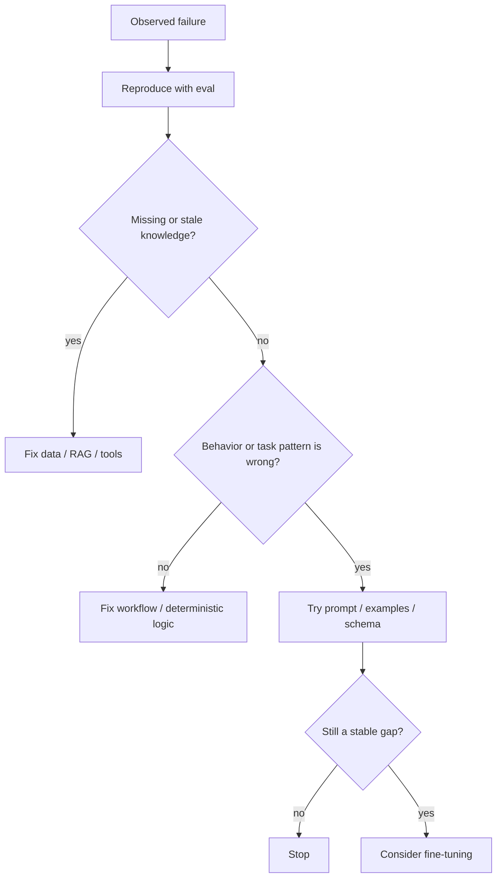

# Model Adaptation and Fine-Tuning

[中文版本](../zh-CN/21-model-adaptation-finetuning.md)

Fine-tuning is useful, but it is frequently applied to problems that are actually caused by missing context, weak evals, bad tool design, or poor workflow architecture. This chapter focuses on **decision discipline** as much as training mechanics.

## Adaptation decision tree



## 1. What fine-tuning changes

Fine-tuning is best thought of as adapting a model's behavior or task distribution.

Good candidates include:

- consistent structured behavior;
- domain-specific classification/extraction;
- style/format conventions;
- specialized tool-use patterns;
- reducing long repetitive instructions;
- improving a narrow behavior that survives prompt/RAG fixes.

Poor default use case:

> “The model does not know our latest internal policy, so let's fine-tune it.”

That is usually a grounding/freshness problem.

## 2. SFT, PEFT, LoRA and QLoRA

Understand the concepts:

- **SFT (Supervised Fine-Tuning):** train on input/output demonstrations.
- **PEFT:** update a small subset of parameters or adapters.
- **LoRA:** low-rank trainable adapters rather than updating every weight.
- **QLoRA:** quantized base model plus LoRA-style adaptation to reduce memory requirements.

You do not need to become a training-infrastructure specialist to be an application AI Engineer, but you should understand the trade-offs.

## 3. Preference optimization

At a conceptual level, know why teams may use preference data rather than only demonstrations.

Examples include:

- pairwise preferred/rejected outputs;
- reward-model-based methods;
- DPO-style preference optimization;
- reinforcement-style post-training.

For application engineering, the key question is not memorizing acronyms; it is understanding what supervision signal is being optimized.

## 4. Dataset design

Training data quality dominates many fine-tuning outcomes.

Define:

- task distribution;
- label/source provenance;
- deduplication;
- class/intent balance;
- edge-case coverage;
- train/validation/test separation;
- leakage checks;
- PII/license constraints.

Keep your final test set out of training and iterative data selection.

## 5. Baselines before training

Before spending GPU time, establish at least:

1. base model baseline;
2. improved prompt baseline;
3. RAG/tool baseline if knowledge is relevant;
4. smaller/larger model comparison where useful.

Then fine-tune and compare on the **same held-out eval**.

## 6. Training metrics are not product metrics

Loss going down is not proof the product improved.

Track both:

### Training signals
- train/validation loss;
- learning-rate behavior;
- overfitting indicators.

### Task signals
- task success;
- schema adherence;
- hallucination/factuality;
- safety;
- latency;
- cost;
- segment-level regressions.

## 7. Catastrophic regression and narrowness

A fine-tuned model can improve the target task while hurting general behavior.

Test:

- target task;
- nearby tasks;
- adversarial/safety cases;
- previously strong capabilities you still depend on.

Do not evaluate only the data distribution you optimized.

## 8. Distillation

Distillation transfers behavior from a stronger/expensive teacher into a smaller/cheaper student.

Useful when:

- task distribution is narrow enough;
- high-quality teacher outputs can be generated/verified;
- latency/cost matter;
- the smaller model can retain required quality.

Always compare **cost per successful task**, not model price alone.

## 9. RAG + fine-tuning are complementary

A common production pattern is:

```text
fine-tuning → teaches behavior / format / domain task pattern
RAG/tools   → supplies current facts and private state
```

They solve different problems and can be combined.

## 10. Deployment and versioning

Version:

- base model;
- training dataset snapshot;
- training code/config;
- adapter/checkpoint;
- tokenizer/template;
- eval dataset;
- serving configuration.

Maintain rollback to the prior model behavior.

## Hands-on project

Choose a narrow task such as support-ticket routing or structured extraction.

Compare:

1. base model;
2. prompt-engineered baseline;
3. few-shot baseline;
4. fine-tuned model.

Report:

- held-out task quality;
- safety/nearby-task regressions;
- latency;
- cost;
- training cost;
- whether the fine-tune is actually justified.

## Definition of Done

You can:

- explain when fine-tuning is the wrong tool;
- distinguish SFT / PEFT / LoRA / QLoRA conceptually;
- design train/validation/test data without leakage;
- establish strong baselines before training;
- evaluate a fine-tuned model on held-out data;
- detect narrow-task gains with broader regressions;
- explain distillation;
- combine RAG and fine-tuning appropriately;
- version and roll back a tuned model.

---

[← AI Data Engineering](20-ai-data-engineering.md) · [AI System Design Patterns →](22-ai-system-design-patterns.md)
