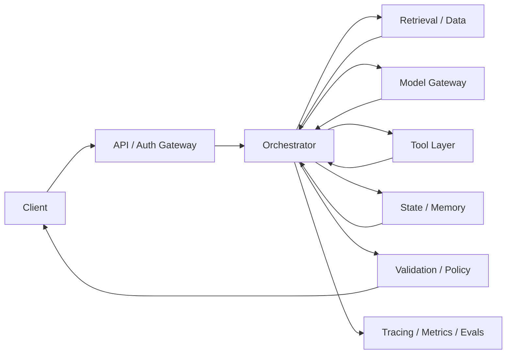
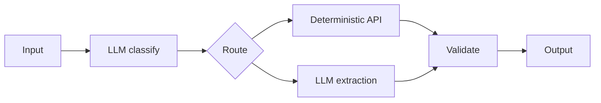
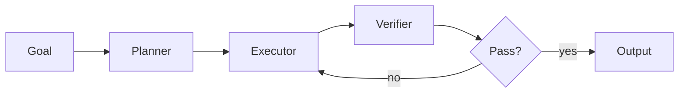

# AI System Design Patterns and Reference Architectures

[中文版本](../zh-CN/22-ai-system-design-patterns.md)

AI system design is not “put an LLM behind an API.” A strong design makes the probabilistic component explicit, limits where it can act, and surrounds it with deterministic software, data, evaluation, and operational controls.

## Reference architecture



## 1. Separate deterministic and probabilistic logic

Use deterministic software for:

- authorization;
- arithmetic/business rules;
- schema validation;
- irreversible action gating;
- state transitions when rules are known;
- exact data queries.

Use models where semantic interpretation, synthesis, planning, or fuzzy decision-making is actually needed.

A useful question:

> **Why is an LLM making this decision instead of normal code?**

## 2. Model Gateway pattern

Hide provider-specific SDKs behind a stable interface.

Responsibilities may include:

- model aliases;
- routing;
- timeout/retry;
- fallback;
- token/cost accounting;
- policy restrictions;
- prompt/model version metadata;
- provider-specific normalization.

This reduces vendor coupling and centralizes operational controls.

## 3. Router pattern

A router decides which path should handle a request.

Examples:

```text
simple FAQ → small model
knowledge question → RAG
exact account fact → database/API
complex open-ended task → agent
high-risk task → human workflow
```

Evaluate routing accuracy separately from downstream task quality.

## 4. Retrieval-then-generate pattern

Use when the answer should be based on private/current knowledge.

Core stages:

`query understanding → retrieval → reranking → context construction → generation → citation validation`

Do not collapse the pipeline into one black box if you need to debug it.

## 5. Deterministic workflow with LLM nodes

Many “agents” are better implemented as workflows.



Benefits:

- predictable control flow;
- easier testing;
- lower cost;
- smaller security surface;
- easier retries and recovery.

## 6. Bounded agent pattern

Use an agent only when the path cannot be usefully predefined.

Bound it with:

- allowlisted tools;
- max steps;
- token/cost budget;
- timeout;
- explicit state;
- approval gates;
- observable trajectory.

Avoid the “LLM while-loop with production credentials” architecture.

## 7. Planner / Executor / Verifier

For complex tasks, separate responsibilities:



The verifier should use deterministic tests where possible. A second model is useful only when the criterion itself is semantic.

## 8. Human approval pattern

Sensitive action architecture:

`agent proposes → policy check → human approval → idempotent executor → audit log`

The human should see enough context to make a meaningful decision, not only “Approve? Yes/No.”

## 9. Asynchronous job pattern

Long AI workflows should often be asynchronous.

Use:

- job ID;
- durable queue;
- persisted state/checkpoints;
- cancellation;
- retries;
- progress events;
- dead-letter handling.

This is usually safer than keeping one HTTP request open through many model/tool calls.

## 10. Cache patterns

Possible caches:

- prompt/prefix cache;
- embedding cache;
- retrieval cache;
- deterministic tool-result cache;
- response cache for safe/repeatable tasks.

Every cache needs an answer to:

- What is the key?
- What is the TTL?
- How is permission isolation preserved?
- How is stale data invalidated?

## 11. Memory patterns

Separate:

- request context;
- conversation state;
- workflow state;
- long-term user memory;
- knowledge base.

Do not call every persistence mechanism “agent memory.” Use normal databases and retrieval patterns where appropriate.

## 12. Failure containment

Design explicit boundaries:

- model failure should not corrupt authoritative state;
- retrieval outage should have a fallback behavior;
- tool timeout should not cause duplicate side effects;
- provider outage should degrade gracefully;
- bad model output should fail validation before execution.

Think in terms of **blast radius**.

## 13. Graceful degradation

Example ladder:

```text
primary model
→ secondary model
→ reduced-capability deterministic/RAG mode
→ human escalation
```

Define which capabilities can safely degrade and which should fail closed.

## 14. Multi-tenant architecture

For enterprise systems, tenant identity should flow through:

`auth → policy → data queries → retrieval → cache keys → tools → traces`

Never add tenant filtering only at the prompt layer.

## 15. Design review checklist

Before implementation, answer:

### Requirements
- What user outcome matters?
- What is the acceptable failure rate?
- What is the latency/cost budget?

### Architecture
- Where is probabilistic logic necessary?
- Can any agent step become deterministic workflow logic?
- What state is durable?

### Data
- What are sources of truth?
- What freshness/ACL constraints exist?

### Reliability
- What happens on model/tool/data outage?
- Are side effects idempotent?

### Security
- What can the model cause to happen?
- What is the blast radius?

### Quality
- What component and end-to-end evals exist?

### Operations
- What gets traced/versioned?
- How do we canary and roll back?

## System-design exercise

Design an enterprise support copilot that:

- answers from internal docs;
- reads customer/account data;
- can draft tickets and refunds;
- requires approval for monetary actions;
- supports thousands of users;
- must prevent cross-tenant leakage.

Produce:

1. architecture diagram;
2. data flow;
3. tool contracts;
4. state machine;
5. failure-mode table;
6. eval strategy;
7. security boundaries;
8. rollout plan.

## Definition of Done

You can select among router, RAG, workflow, bounded-agent, async-job and human-approval patterns; separate deterministic/probabilistic logic; design failure containment; explain state/memory choices; and defend the architecture using quality, latency, cost, reliability and security trade-offs.

---

[← Model Adaptation & Fine-Tuning](21-model-adaptation-finetuning.md) · [Multimodal AI Systems →](23-multimodal-ai-systems.md)
