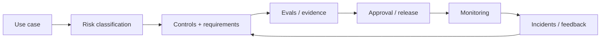

# AI Governance, Responsible AI and Model Risk

[中文版本](../zh-CN/24-ai-governance-model-risk.md)

Security asks, “Can an attacker or bad input make the system do something unsafe?” Governance asks broader questions: **Who owns the risk? What evidence is required before release? What behavior is prohibited? How are changes reviewed, monitored, audited, and rolled back?**

## Governance lifecycle



## 1. Start with use-case risk, not model prestige

The same model can be low-risk in one workflow and high-risk in another.

Examples:

- drafting internal notes: usually lower risk;
- recommending a refund: medium operational risk;
- autonomously issuing payments: high action risk;
- making consequential employment/credit/health decisions: potentially high legal and human-impact risk.

Classify the **system and use case**, not only the model.

## 2. Define ownership

Every production AI capability should have clear owners for:

- product outcome;
- technical operation;
- data;
- security/privacy;
- evaluation/quality;
- incident response.

A governance failure often starts with “everyone thought someone else was responsible.”

## 3. Model and system inventory

Maintain an inventory of:

- models/providers;
- model versions/aliases;
- prompts/policies;
- retrieval indexes/data sources;
- tools/actions;
- fine-tuned adapters;
- external dependencies;
- approved use cases.

This becomes important when a provider, model, policy, or data source changes.

## 4. Risk taxonomy

A practical taxonomy may include:

- factual/quality risk;
- safety risk;
- privacy/confidentiality risk;
- security risk;
- bias/fairness risk;
- legal/compliance risk;
- financial/operational risk;
- reputational risk;
- autonomy/action risk.

Do not treat every risk as “hallucination.”

## 5. Controls should match risk

Possible controls:

- grounding/citations;
- deterministic validation;
- content/policy filters;
- access control;
- approval gates;
- action limits;
- rate/cost limits;
- sandboxing;
- logging/audit;
- fallback;
- human escalation;
- restricted deployment population.

Higher-risk use cases should require stronger evidence and tighter controls.

## 6. Release evidence

A production release should be supported by an **evidence package**, not a statement that the demo looked good.

Example:

```text
use case + risk class
architecture / data-flow diagram
model and prompt versions
eval dataset + results
segment/safety results
known limitations
security review
privacy/data-retention decision
rollback plan
owner / approver
```

## 7. Known limitations

Document limitations explicitly:

- unsupported languages;
- weak document types;
- high-risk tasks the system must refuse;
- known retrieval gaps;
- tool/action boundaries;
- confidence limits.

A mature system does not pretend uncertainty does not exist.

## 8. Human oversight

Human-in-the-loop should be designed, not added as a vague disclaimer.

Specify:

- what triggers review;
- what information the reviewer sees;
- whether the user can edit/override;
- who is authorized to approve;
- how approval is logged;
- what happens if no reviewer responds.

## 9. Auditability and traceability

For important workflows, preserve enough evidence to reconstruct:

- request/input;
- model/prompt version;
- retrieved evidence;
- tool calls/results;
- policy decisions;
- human approvals;
- final action/output.

Balance auditability with privacy and retention requirements.

## 10. Change management

AI behavior can change when any of these change:

- model version;
- provider behavior;
- prompt;
- retrieval corpus/index;
- tool schema;
- policy;
- fine-tune;
- upstream data.

Define which changes require:

- regression eval;
- security review;
- approval;
- canary rollout;
- user communication.

## 11. Model/provider updates

Do not assume a newer model is automatically safe to replace the old one.

Treat upgrades as releases:

`candidate model → offline eval → safety/segment eval → shadow/canary → monitor → promote/rollback`

## 12. Incident response

Prepare for AI-specific incidents:

- data exposure;
- unsafe tool action;
- widespread hallucination/regression;
- malicious prompt-injection campaign;
- provider/model outage;
- policy bypass.

Incident plan:

```text
detect
→ contain / disable risky capability
→ preserve evidence
→ assess impact
→ communicate/escalate
→ remediate
→ add regression/security tests
→ postmortem
```

## 13. Fairness and segment performance

For use cases where outcomes affect people, aggregate accuracy can hide harmful disparities.

Where appropriate:

- define relevant cohorts;
- measure segment-level errors;
- inspect data coverage/label quality;
- involve domain/legal stakeholders;
- avoid inventing demographic inference when data should not be collected.

The engineering principle is: know **for whom and under what conditions** the system works.

## 14. Privacy by design

Define before deployment:

- what user data is sent to which provider;
- retention/logging rules;
- PII/secrets redaction;
- training-use settings where applicable;
- deletion workflows;
- access to traces;
- regional/data-residency constraints where relevant.

Do not discover your privacy architecture after production logs already contain sensitive prompts.

## 15. Governance is not a substitute for engineering

Policies without technical enforcement are weak controls.

Examples:

- “Do not access unauthorized data” must become ACL enforcement.
- “Do not spend over $100” must become deterministic action limits.
- “High-risk actions need approval” must become an executable gate.

Translate policy into code, configuration, tests, and observable evidence wherever possible.

## Hands-on exercise

Take the Operations Agent from the roadmap and create a **release evidence package**:

1. use-case/risk classification;
2. ownership matrix;
3. architecture/data-flow diagram;
4. model/data/tool inventory;
5. eval and safety results;
6. known limitations;
7. approval matrix;
8. audit/retention policy;
9. rollback plan;
10. incident playbook.

## Definition of Done

You can classify use-case risk, define accountable ownership, maintain a model/system inventory, map risks to technical controls, prepare release evidence, design human oversight and auditability, manage model/data/prompt changes, and create an AI-specific incident response loop.

---

[← Multimodal AI Systems](23-multimodal-ai-systems.md)
