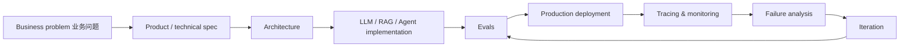
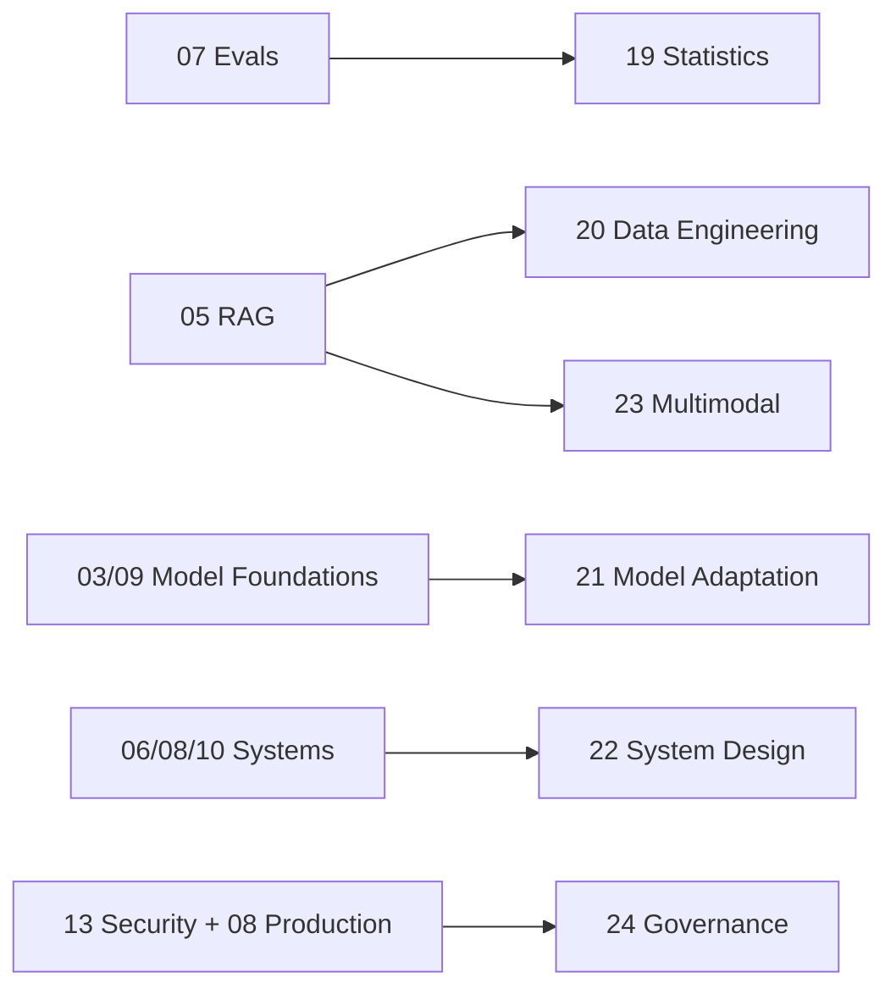

# 如何阅读与使用这套路线

[English version](../en/00-reading-guide.md)

这不是一套“GenAI 教程合集”，而是一套以 **production AI Engineering** 为目标的系统训练路线。它以 Andrew Ng 2026 年的 AI Engineering Skills Map 为起点，再把高层 skill taxonomy 拆解为可以逐步执行、可以验收的工程能力。

## 最终目标能力

一个 qualified AI Engineer 应该能够独立负责完整闭环：

目标不是：

- “我会 LangChain”；
- “我会调用模型 API”；
- “我会写 prompt”。

目标应该能够用一句工程化英文表达：

> **I can turn probabilistic model behavior into a measurable, controllable, secure, and maintainable software system.**

也就是：你能把本质上具有概率性、会出错的 AI component，封装成一个可测量、可控制、可维护、可上线的系统。

## 推荐阅读顺序

### 第一遍：建立 mental model

1. Andrew Ng 文章拆解；
2. AI Engineer competency map；
3. LLM foundations；
4. Prompt & Context Engineering。

### 第二遍：开始构建 AI systems

5. Grounding / Retrieval / RAG；
6. Agentic Systems；
7. Evaluation-Driven Development。

### 第三遍：进入 production

8. Production AI / LLMOps；
9. ML foundations；
10. Software Engineering foundations；
11. AI Security & Safety。

### 第四遍：从“会实现”变成“会负责”

12. Coding Agents；
13. Shaping the Build；
14. 24-week execution plan；
15. Portfolio projects；
16. Interview readiness。

`Resources` 和 `Glossary` 全程查阅。

## 第五遍：Advanced Cross-Cutting Tracks

核心 `00–18` 已经足够覆盖 Andrew Ng Skills Map 的主要结构。下面 6 章属于 **second-layer production depth**：它们不是 Andrew Ng 额外提出的 6 个 headline categories，而是把原框架中横跨多个能力的工程责任进一步显式化。

| Advanced Track | 为什么值得单独学习 | 推荐插入位置 |
|---|---|---|
| [Statistics for AI Evals & Experimentation](19-statistics-for-evals-experimentation.md) | 给 EDD 补上 uncertainty、paired comparison、bootstrap、judge calibration、A/B testing | 07 之后 |
| [AI Data Engineering & Feedback Loops](20-ai-data-engineering.md) | 把 “grounding with data” 从 vector search 扩展到 freshness、lineage、structured data、ACL、trace-to-eval data | 05 之后 |
| [Model Adaptation & Fine-Tuning](21-model-adaptation-finetuning.md) | 系统学习什么时候该/不该 fine-tune，dataset design、LoRA/PEFT、distillation、held-out eval | 03/09 之后 |
| [AI System Design Patterns](22-ai-system-design-patterns.md) | 把 router、RAG、workflow、bounded agent、async job、HITL、failure containment 统一成 architecture patterns | 06/08/10 之后 |
| [Multimodal AI Systems](23-multimodal-ai-systems.md) | 覆盖 PDF、image、chart、OCR、audio/video 与 modality-specific eval | LLM/RAG 基础后 |
| [AI Governance & Model Risk](24-ai-governance-model-risk.md) | 补 risk classification、ownership、release evidence、auditability、change management、incident response | Security/Production 之后 |

你**不需要先把这 6 章全部掌握才能开始申请 AI Engineer**。按照目标岗位选择优先级：

- **Application / Agent Engineer**：19、20、22 优先级最高；
- **ML-heavy Applied AI**：19、20、21；
- **Enterprise / Platform AI**：19、20、22、24；
- **Document / Voice / Vision product**：尽早加入 23；
- **regulated / high-impact system**：24 属于必须深入的内容。

## 每周时间分配

建议：

- **30% learning**：official docs、paper、核心理论；
- **60% building**：代码、实验、eval；
- **10% writing**：architecture notes、ADR、failure analysis。

如果你的时间结构是“80% 看课 + 20% 写代码”，应当反过来。

## 每个主题至少学习三遍

**Pass A — Recognition**：看懂术语、架构和常见 pattern。

**Pass B — Construction**：自己实现最小系统，避免一开始完全躲在 framework 后面。

**Pass C — Productionization**：加入 eval、observability、security、cost/latency constraints、failure handling。

## 什么才算真正学过

每个 module 至少产生一个 durable artifact：

- code；
- experiment；
- eval dataset；
- benchmark；
- architecture diagram；
- ADR；
- failure-analysis note；
- deployment；
- postmortem。

## Job-ready 的直观验收

你应该能够对白板题：

> “Build an enterprise AI assistant that uses private documents and business tools.”

主动覆盖：

**requirements → model selection → context → retrieval → tools → state → evals → security → observability → latency → cost → rollout → rollback → feedback loop**。

如果你的回答仍然只有：

> “Use LangChain + vector DB + GPT.”

那还没有达到 production AI Engineer 的标准。

---

[Andrew Ng AI Engineering Skills Map — 详细拆解 →](01-andrew-ng-analysis.md)
