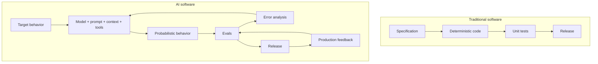
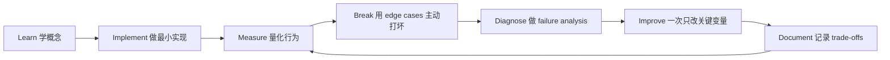

# Andrew Ng AI Engineering Skills Map — 详细拆解

[English version](../en/01-andrew-ng-analysis.md)

## 原始框架

Andrew Ng 在 2026 年 8 月发布的 AI Engineering Skills Map，把现代 AI Engineering 分为四大类：

1. **Building and deploying AI applications**
2. **Software engineering fundamentals**
3. **Using coding agents**
4. **Shaping the build**

随后对第一类又进一步拆为：

- **LLM foundations**
- **grounding models with data**
- **building agentic systems**
- **evaluation-driven development**
- **operating in production**
- **machine learning foundations**

底层贯穿的是 **continuous learning**。

这些英文表达建议直接保留，因为这就是行业中最自然的说法。

## AI software 与 traditional software 的核心差异

传统 software 更接近 deterministic system；LLM application 的行为具有明显的 probabilistic nature。

因此 AI Engineering 中的“spec”不再只是需求文档，还越来越表现为：

> **target behavior + eval suite + operational constraints**

## 这张地图真正告诉我们的是什么

它不是 framework checklist，而是 engineering responsibility map。

低质量表达：

- “I know LangGraph.”
- “I know Pinecone.”
- “I can prompt GPT.”

更成熟的表达：

- **I can separate retrieval failures from generation failures.**
- **I can quantify whether reranking improves end-to-end task success.**
- **I can bound an agent's permissions and blast radius.**
- **I can detect regressions after a model or prompt change.**
- **I know when not to use an agent.**

真正面试时，这类表达远比报一串工具名字有价值。

## 为什么 Evals 是第一等公民

demo-oriented workflow：

`prompt → 看 5 个例子 → 感觉不错 → deploy`

production workflow：

`define target behavior → representative dataset → baseline → automated eval → failure taxonomy → error analysis → change → regression test → rollout → production feedback`

所以 **evaluation-driven development** 不是“上线前顺便测一下”，而应该是 AI development lifecycle 的中心环节。

## 为什么 Software Engineering 反而更重要

Coding agents 降低实现成本以后，人的价值更集中在：

- architecture；
- interface design；
- consistency；
- retries / idempotency；
- security boundaries；
- observability；
- rollout / rollback；
- maintainability。

一句很值得记住的英文：

> **The faster code can be produced, the more expensive bad architectural judgment becomes.**

## 为什么 Shaping the Build 很重要

当 implementation 更便宜以后，工程师的价值开始向上游移动：

- Is this the right problem?
- What is the user outcome?
- What should the system refuse to do?
- What is the evaluation criterion?
- What is the cheapest architecture that meets the target?
- When should a human enter the loop?

## 本仓库对 Andrew Ng 框架的扩展

为了达到 production-ready，这套路线额外单独加入：

- Prompt & Context Engineering；
- AI security / prompt injection defense；
- data lifecycle / ACL-aware retrieval；
- reliability patterns；
- cost / latency engineering；
- product metrics；
- human escalation。

这些不是在“反驳”原框架，而是在把高层 skills map 变成真正可执行的 engineering curriculum。

## Primary references

- Andrew Ng X post (2026-08-21): https://x.com/AndrewYNg/status/2090840747738374568
- DeepLearning.AI detailed article: https://www.deeplearning.ai/the-batch/he-ai-engineering-skills-map-in-detail-building-and-deploying-ai-applications
- Andrew Ng, Writing: https://www.andrewng.org/writing
- DeepLearning.AI, The Batch: https://www.deeplearning.ai/the-batch/

## 如何学习本章

不要采用“看完课程 = 学会了”的方式。使用下面这个工程闭环：

判断本章是否学完，不是看你是否“听说过”术语，而是看你能否 **build it, measure it, debug it, and explain the trade-offs**。中文学习过程中务必保留常见英文表达，因为真实代码库、设计文档、面试和工程讨论通常直接使用这些术语。
---

[← 如何阅读与使用这套路线](00-reading-guide.md)  ·  [AI Engineer 能力地图 →](02-ai-engineer-skill-map.md)
