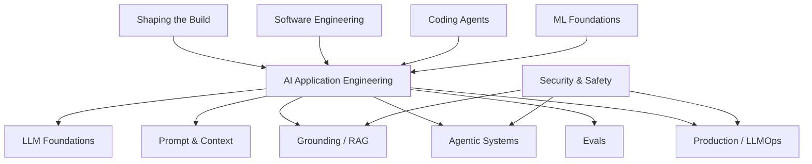
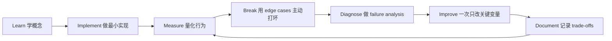

# AI Engineer 能力地图

[English version](../en/02-ai-engineer-skill-map.md)

## 完整能力栈

## P0 — Must-have

这些是“缺一个就很难称为 production AI Engineer”的能力：

- 一门 production backend language；
- API、async I/O、concurrency；
- LLM API integration；
- structured outputs；
- function/tool calling；
- embeddings；
- retrieval / RAG；
- eval design；
- error analysis；
- agent workflow；
- tracing / observability；
- Docker / cloud deployment；
- SQL / data modeling；
- Git / CI/CD；
- security fundamentals。

## P1 — Strong differentiators

能明显区分“会做 demo”和“能做生产系统”的能力：

- hybrid retrieval / reranking；
- agent state / memory；
- human-in-the-loop；
- model routing / fallback；
- caching；
- prompt/model/version management；
- offline / online eval；
- LLM-as-judge calibration；
- cost / latency optimization；
- fine-tuning basics。

## P2 — Role-dependent depth

根据岗位方向深入：

- PyTorch；
- LoRA / QLoRA；
- distributed training；
- inference serving；
- GPU optimization；
- post-training；
- multimodal；
- advanced retrieval；
- self-hosted open-weight models。

## 用四个动词记住 AI Engineer

**BUILD** — 把 model capability 变成 product。

**MEASURE** — 用数据证明系统是否工作。

**OPERATE** — 在 production 中可靠运行。

**DECIDE** — 判断做什么、怎么做、接受什么 trade-off。

如果只有 BUILD，往往只是 demo engineer；四项都具备，才越来越接近 mature AI Engineer。

## 如何学习本章

不要采用“看完课程 = 学会了”的方式。使用下面这个工程闭环：

判断本章是否学完，不是看你是否“听说过”术语，而是看你能否 **build it, measure it, debug it, and explain the trade-offs**。中文学习过程中务必保留常见英文表达，因为真实代码库、设计文档、面试和工程讨论通常直接使用这些术语。
---

[← Andrew Ng AI Engineering Skills Map — 详细拆解](01-andrew-ng-analysis.md)  ·  [LLM Foundations：大模型基础 →](03-llm-foundations.md)
