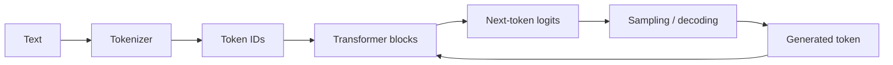
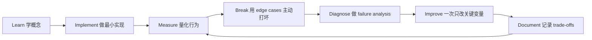

# LLM Foundations：大模型基础

[English version](../en/03-llm-foundations.md)

## 先建立正确的 mental model

你不需要一开始就成为 foundation-model researcher，但必须理解模型为什么会表现成现在这样。

## 必须掌握的内容

### Tokenization
**Token is not the same as word.**

必须知道 token count 会影响：

- context capacity；
- latency；
- cost；
- chunk size；
- caching strategy。

练习：比较英文、中文和 source code 的 tokenization 差异。

### Embeddings
理解：

- dense vector；
- cosine similarity；
- dot product；
- nearest-neighbor search。

同时牢记：

> **High embedding similarity does not imply factual correctness.**

### Transformer
至少能解释：

- self-attention；
- Q / K / V 的直觉；
- causal mask；
- multi-head attention；
- MLP block；
- residual connection；
- positional information。

### Autoregressive generation
理解：

- logits；
- softmax；
- greedy decoding；
- sampling；
- temperature；
- top-p；
- stop condition。

### Context window
以下全部在竞争有限的 context budget：

- system instruction；
- conversation history；
- retrieved documents；
- tool outputs；
- agent state。

这正是 **Context Engineering** 的基础。

### KV cache
达到 intermediate / senior 方向以后，应能解释：

- 为什么 decoding 可以重复利用过去的 K/V；
- long context 为什么会增加 serving memory；
- context length 如何影响 concurrency / throughput。

### Training lifecycle
至少区分：

- pretraining；
- SFT；
- preference optimization；
- reinforcement-style post-training；
- distillation；
- fine-tuning。

## API 层必须熟练

至少使用两个 provider，避免形成 vendor-specific mental model。

练习：

- sync / async；
- streaming；
- structured outputs；
- tool/function calling；
- multimodal；
- timeout / retry；
- rate limit；
- token / cost accounting。

## Model selection 的正确问法

不要问：

> Which model is the best?

应该问：

> **Which model maximizes expected task value under quality, latency, cost, privacy, and reliability constraints?**

用同一个 eval dataset 比较多个模型。

## Hands-on Project

做一个 **Structured Extraction Service**：

输入可以是 support ticket / invoice / contract。

要求：

- JSON schema；
- validation；
- retry / fallback；
- batch processing；
- token / latency metrics；
- 100-case eval dataset。

## Definition of Done

你能够解释 Transformer inference path，熟练 structured outputs / tool calling，能够记录 token/cost/latency，并能通过 reproducible eval 做 model comparison。

## 如何学习本章

不要采用“看完课程 = 学会了”的方式。使用下面这个工程闭环：

判断本章是否学完，不是看你是否“听说过”术语，而是看你能否 **build it, measure it, debug it, and explain the trade-offs**。中文学习过程中务必保留常见英文表达，因为真实代码库、设计文档、面试和工程讨论通常直接使用这些术语。
---

[← AI Engineer 能力地图](02-ai-engineer-skill-map.md)  ·  [Prompt & Context Engineering：提示词与上下文工程 →](04-prompt-context-engineering.md)
