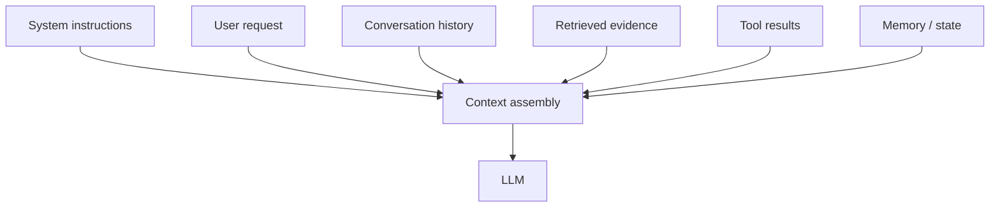
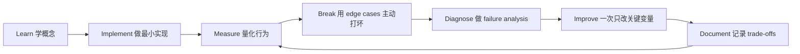

# Prompt & Context Engineering：提示词与上下文工程

[English version](../en/04-prompt-context-engineering.md)

**Prompt Engineering 只是 Context Engineering 的一部分。**

## 核心认知

模型行为高度依赖：

- context 里有什么；
- 信息如何组织；
- instruction priority；
- 是否存在冲突或噪声。

所以成熟的 AI Engineer 应该把 **the entire context as a designed data structure**，而不是把 prompt 当一段“魔法文字”。

## Prompt design

需要练习：

- clear role and objective；
- explicit constraints；
- output schema；
- few-shot examples；
- instructions 与 untrusted data 分离；
- 能用 deterministic validation 的地方不要只说 “please be careful”。

## Context budgeting

必须能够量化：

- fixed instruction tokens；
- retrieved context；
- conversation history；
- tool outputs；
- expected output。

不要盲目 **context stuffing**。更多 context 不一定更好，irrelevant/conflicting evidence 反而可能降低 accuracy。

## Prompt versioning

把 prompt 当 code：

- version；
- code review；
- attach eval results；
- rollback；
- trace 中记录 prompt ID。

常见工程表达：

> **This prompt change improved the target eval by 6.2 points but increased input tokens by 18%.**

## Structured outputs

如果下游代码需要消费模型结果，应优先使用 typed schema，并用 deterministic code validation。

不要相信：

> “我在 prompt 里让它输出 JSON，所以一定是合法 JSON。”

## 常见 failure modes

- instruction conflict；
- stale context；
- irrelevant context；
- duplicated evidence；
- missing evidence；
- prompt injection；
- oversized tool output；
- conversation-history drift。

## 实践

对同一个 extraction/support task 逐步比较：

1. vague prompt；
2. explicit task contract；
3. structured output；
4. few-shot；
5. context compression；
6. eval-driven prompt iteration。

不要凭感觉“调 prompt”；始终用 eval 验证。

## 如何学习本章

不要采用“看完课程 = 学会了”的方式。使用下面这个工程闭环：

判断本章是否学完，不是看你是否“听说过”术语，而是看你能否 **build it, measure it, debug it, and explain the trade-offs**。中文学习过程中务必保留常见英文表达，因为真实代码库、设计文档、面试和工程讨论通常直接使用这些术语。
---

[← LLM Foundations：大模型基础](03-llm-foundations.md)  ·  [Grounding、Retrieval 与 RAG →](05-grounding-rag.md)
