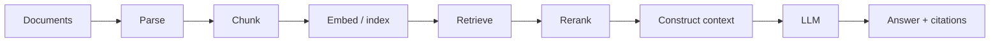
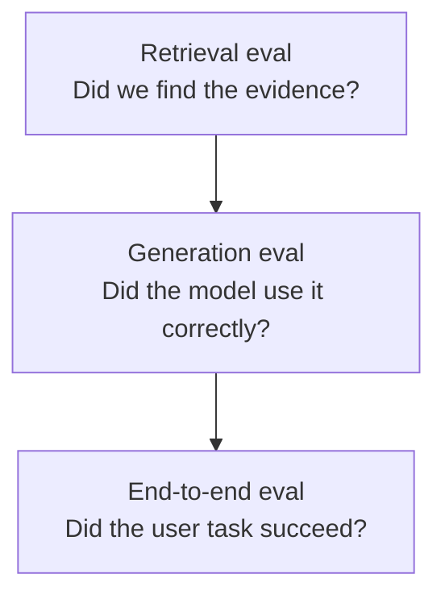
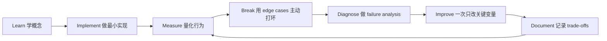

# Grounding、Retrieval 与 RAG

[English version](../en/05-grounding-rag.md)

## 标准 pipeline

## Ingestion
生产系统必须处理：

- document identity；
- metadata；
- versioning；
- deduplication；
- timestamp；
- ACL；
- update；
- delete。

**“We indexed the docs once.” 不是 production data strategy。**

## Chunking
需要比较：

- fixed-token；
- paragraph；
- section-aware；
- semantic；
- parent-child chunking。

不要靠网上流传的“500 tokens 最佳”这类经验决定，应该通过 retrieval eval 选择。

## Retrieval
必须掌握：

- dense / vector retrieval；
- sparse / BM25；
- hybrid search；
- metadata filter；
- query rewriting；
- multi-query retrieval。

## Reranking
常见架构：

`retrieve top-N candidates → rerank → select evidence → construct context`

retrieval quality 与 final answer quality 要分层评估。

## 三层 Eval

指标可以包括：

- Recall@K；
- Precision@K；
- MRR / NDCG；
- correctness；
- faithfulness；
- completeness；
- citation accuracy。

## RAG vs Long Context vs Fine-Tuning

**RAG**：知识动态、private、大规模，需要 citation / ACL。

**Long context**：corpus 不大，一次性分析，整体文档关系很重要。

**Fine-tuning**：主要改变 behavior / style / task pattern，而不是默认拿来“记事实”。

## Security
必须把 retrieved content 当成 **untrusted data**，防：

- prompt injection；
- data leakage；
- cross-tenant exposure；
- ACL bypass。

## Project
实现 Enterprise Knowledge Assistant：

- hybrid retrieval；
- reranker；
- citations；
- incremental indexing；
- ACL filtering；
- tracing；
- 至少 100 条 evaluation questions。

## 如何学习本章

不要采用“看完课程 = 学会了”的方式。使用下面这个工程闭环：

判断本章是否学完，不是看你是否“听说过”术语，而是看你能否 **build it, measure it, debug it, and explain the trade-offs**。中文学习过程中务必保留常见英文表达，因为真实代码库、设计文档、面试和工程讨论通常直接使用这些术语。
---

[← Prompt & Context Engineering：提示词与上下文工程](04-prompt-context-engineering.md)  ·  [Agentic Systems Engineering：智能体系统工程 →](06-agentic-systems.md)
