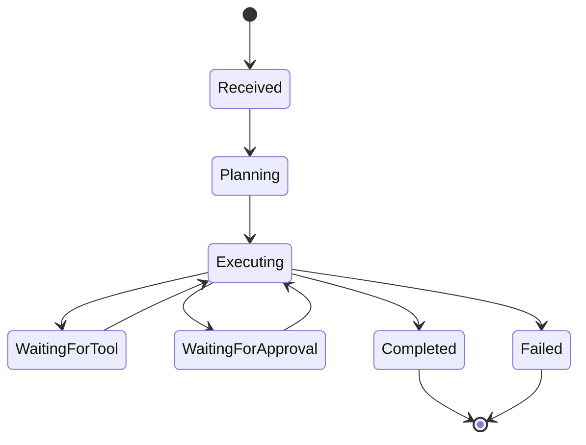
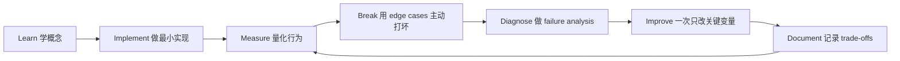

# Agentic Systems Engineering：智能体系统工程

[English version](../en/06-agentic-systems.md)

## 一个更工程化的 Agent 定义

Agent 不是“多轮聊天”的同义词。

更实用的定义：

> **An agent is a system in which a model participates in selecting actions based on goal, state, and environment feedback.**

## 学习顺序

1. typed tool calling；
2. single-agent loop；
3. explicit state；
4. planning when needed；
5. memory；
6. human-in-the-loop；
7. multi-agent。

不要一开始就冲 multi-agent。

## Workflow vs Agent

process 已知、sequence 固定、correctness 要求高的时候，优先 deterministic workflow。

真正需要 agent 的情况：

- path 很难提前定义；
- task 需要 dynamic decision-making；
- environment feedback 会改变下一步；
- tool selection 本身就是开放问题。

记住：

> **If you can express the control flow clearly in normal code, prefer normal code.**

## Tool Design

好的 tool 应该：

- narrow；
- typed；
- observable；
- low privilege；
- easy to test。

非常危险的设计：

`execute_any_sql(sql)`

更成熟的思路是 read-only、allowlist、row limit、timeout、audit，或者直接设计 domain-specific tools。

## Reliability

必须设计：

- max iterations；
- token/cost budget；
- timeout / cancel；
- retry/backoff；
- checkpoint；
- idempotency；
- dead-letter handling；
- fallback；
- human escalation。

## Agent Eval

不要只看 final answer。

还应测：

- task success；
- tool selection correctness；
- unnecessary steps；
- loop rate；
- recovery；
- cost；
- unauthorized action。

## Project
构建一个 Operations Agent：

- search internal docs；
- query read-only APIs；
- produce action plan；
- create ticket；
- sensitive action 需要 approval；
- every step is traced。

## 如何学习本章

不要采用“看完课程 = 学会了”的方式。使用下面这个工程闭环：

判断本章是否学完，不是看你是否“听说过”术语，而是看你能否 **build it, measure it, debug it, and explain the trade-offs**。中文学习过程中务必保留常见英文表达，因为真实代码库、设计文档、面试和工程讨论通常直接使用这些术语。
---

[← Grounding、Retrieval 与 RAG](05-grounding-rag.md)  ·  [Evaluation-Driven Development：评估驱动开发 →](07-evaluation-driven-development.md)
