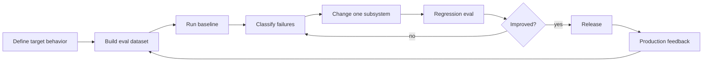
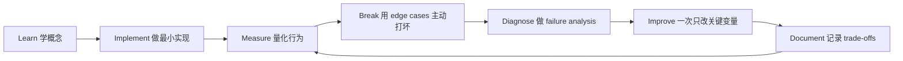

# Evaluation-Driven Development：评估驱动开发

[English version](../en/07-evaluation-driven-development.md)

这是 AI Engineer 最核心、也最容易被低估的能力之一。

## 核心闭环

## Golden Dataset
从 30–50 条开始即可，再从真实 failures 不断扩展。

必须覆盖：

- normal cases；
- edge cases；
- ambiguous cases；
- adversarial cases；
- long input；
- missing data；
- safety cases。

## Evaluator 类型

**Deterministic evaluator**：schema、exact field、permission、tool argument、latency threshold。

**Model-based evaluator**：correctness、relevance、completeness、faithfulness。

**Pairwise eval**：system A vs system B。

**Human eval**：高细粒度 domain quality，以及自动 judge 的 calibration ground truth。

## LLM-as-Judge

不要把 judge model 当 oracle。

要做到：

- explicit rubric；
- narrow criteria；
- human calibration；
- consistency checks。

常见表达：

> **We calibrated the model judge against a human-labeled set before using it as a release gate.**

## Error Analysis

先分类 failure，再决定下一步工程工作。

如果 45% 的错误来自 retrieval，继续微调 system prompt 往往不是最高 leverage 的工作。

## Quality / Cost / Latency 一起看

AI system optimization 永远不是单指标。

一个 quality +2 points、cost ×3、p95 latency ×2 的变化，未必值得上线。

## CI/CD

PR 上跑 smoke eval；nightly 或定期跑 full suite。

每一次重要 production failure：

`reproduce → add regression case → fix → keep it forever`

## 核心原则

> **The eval suite gradually becomes the executable behavioral specification of the AI system.**

这句话非常值得记住。

## 如何学习本章

不要采用“看完课程 = 学会了”的方式。使用下面这个工程闭环：

判断本章是否学完，不是看你是否“听说过”术语，而是看你能否 **build it, measure it, debug it, and explain the trade-offs**。中文学习过程中务必保留常见英文表达，因为真实代码库、设计文档、面试和工程讨论通常直接使用这些术语。
---

[← Agentic Systems Engineering：智能体系统工程](06-agentic-systems.md)  ·  [Production AI 与 LLMOps →](08-production-llmops.md)
