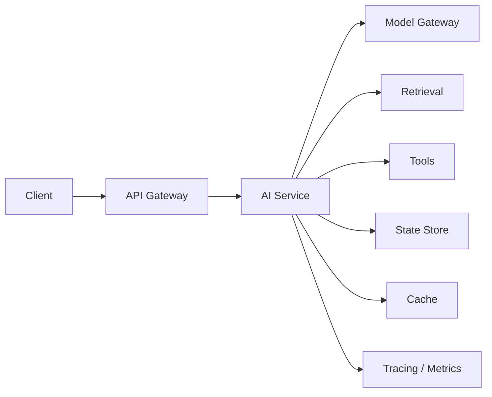
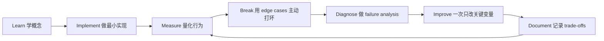

# Production AI 与 LLMOps

[English version](../en/08-production-llmops.md)

## Production architecture

Demo 与 production 的分界，不在 UI 好不好看，而在 system 是否具备可运维能力。

## Observability

至少记录：

- request ID；
- user / tenant；
- model；
- prompt version；
- retrieval / index version；
- latency breakdown；
- token usage；
- cost；
- tool calls；
- error；
- quality signal；
- user feedback。

没有 trace 的 agent / RAG system 在 production 出问题后几乎无法 debug。

## Reliability Patterns

必须熟悉：

- timeout；
- bounded retry；
- exponential backoff；
- circuit breaker；
- fallback；
- idempotency；
- cancellation；
- human escalation。

## Cost Engineering

不要只看 `$ / 1M tokens`，应该看：

> **cost per successful task**

常见优化：

- model routing；
- smaller model；
- caching；
- context reduction；
- batching；
- fewer agent round trips。

## Latency Engineering

拆解：

`network + retrieval + model + tools + post-processing`

跟踪：

- p50；
- p95；
- p99。

优化：

- streaming；
- async I/O；
- parallel calls；
- cache；
- fewer round trips。

## Version Everything

至少 version：

- model；
- prompt；
- embedding model；
- index；
- retrieval config；
- tool schema；
- policy；
- eval dataset。

## Rollout

学习：

- shadow traffic；
- canary；
- A/B；
- rollback。

Prompt/model change 与 code change 一样可能 regression。

## Drift

监控：

- provider behavior；
- user distribution；
- documents；
- business policy；
- tool/API。

并把 sampled production traffic 放回 eval pipeline。

## Project
把 RAG/Agent 真正 deploy：

- auth；
- rate limit；
- secrets；
- tracing；
- dashboard；
- fallback；
- rollback；
- load test。

最终报告 p95 latency、failure rate、cost per successful task。

## 如何学习本章

不要采用“看完课程 = 学会了”的方式。使用下面这个工程闭环：

判断本章是否学完，不是看你是否“听说过”术语，而是看你能否 **build it, measure it, debug it, and explain the trade-offs**。中文学习过程中务必保留常见英文表达，因为真实代码库、设计文档、面试和工程讨论通常直接使用这些术语。
---

[← Evaluation-Driven Development：评估驱动开发](07-evaluation-driven-development.md)  ·  [Machine Learning Foundations：机器学习基础 →](09-machine-learning-foundations.md)
