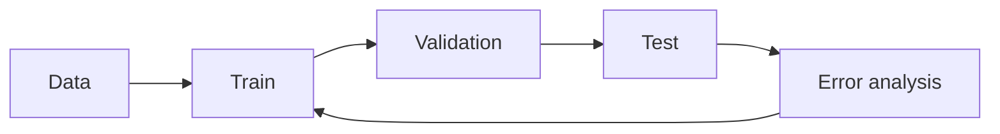
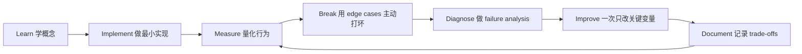

# Machine Learning Foundations：机器学习基础

[English version](../en/09-machine-learning-foundations.md)

## 为什么 AI Engineer 仍然需要 ML

使用 foundation-model API 并不意味着可以跳过：

- data distribution；
- train / validation / test；
- overfitting；
- metrics；
- statistical uncertainty；
- optimization；
- fine-tuning。

这些基础直接决定你是否真正理解 eval。

## 必须掌握

- supervised classification / regression；
- train/validation/test split；
- precision / recall / F1；
- ROC-AUC / PR-AUC；
- bias / variance；
- generalization；
- mean / variance / distribution；
- conditional probability；
- confidence interval；
- sampling intuition；
- gradient descent；
- neural network / backpropagation；
- representation learning / embeddings。

## Fine-Tuning 判断顺序

在 fine-tune 之前先问：

1. Can prompting solve it?
2. Is missing context the real problem?
3. Is the workflow broken?
4. Does held-out evaluation show a persistent behavioral limitation?

然后才考虑：

- SFT；
- PEFT；
- LoRA / QLoRA；
- 其他 post-training methods。

## 实践

做两个项目：

1. 一个 classical ML project，严格 train/val/test + error analysis；
2. 一个小型 fine-tuning experiment，必须有 before/after held-out eval。

不要只展示“loss 降了”，而要展示真实 task metric 是否提升。

## 如何学习本章

不要采用“看完课程 = 学会了”的方式。使用下面这个工程闭环：

判断本章是否学完，不是看你是否“听说过”术语，而是看你能否 **build it, measure it, debug it, and explain the trade-offs**。中文学习过程中务必保留常见英文表达，因为真实代码库、设计文档、面试和工程讨论通常直接使用这些术语。
---

[← Production AI 与 LLMOps](08-production-llmops.md)  ·  [Software Engineering Foundations：软件工程底座 →](10-software-engineering-foundations.md)
