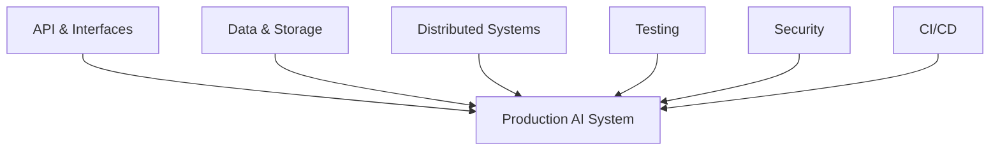
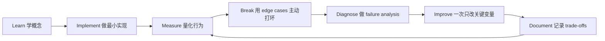

# Software Engineering Foundations：软件工程底座

[English version](../en/10-software-engineering-foundations.md)

Andrew Ng 把 Software Engineering Fundamentals 单独列出来是非常重要的：AI 不会让这些基础消失，反而会因为 coding agents 使代码生产变快，而进一步放大 architecture 的重要性。

## Backend

熟悉：

- HTTP；
- REST / RPC；
- authentication；
- serialization；
- schemas；
- async I/O；
- concurrency。

## Data Systems

熟悉：

- relational modeling；
- indexes；
- transaction；
- isolation；
- NoSQL trade-offs；
- cache；
- queue。

## Distributed Systems

理解：

- partial failure；
- timeout；
- retry；
- backpressure；
- idempotency；
- at-least-once delivery；
- eventual consistency；
- rate limiting；
- circuit breaker。

## Testing

必须同时有：

- unit tests；
- integration tests；
- E2E tests；
- AI evals。

**AI evals do not replace deterministic tests.**

## Architecture

能够画：

- component diagram；
- data flow；
- trust boundary；
- state transition。

并回答：

- Why this architecture?
- What are the failure modes?
- Where is the bottleneck?
- Where is the security boundary?
- How do we roll back?

## CI/CD

典型 pipeline：

`lint → unit tests → integration tests → AI eval smoke test → build → deploy`

## Coding-Agent Era

代码生成越快，以下东西越重要：

- explicit interfaces；
- typed schemas；
- tests；
- architecture constraints；
- code review。

因为：

> **AI can accelerate implementation, but it does not eliminate system consequences.**

## 如何学习本章

不要采用“看完课程 = 学会了”的方式。使用下面这个工程闭环：

判断本章是否学完，不是看你是否“听说过”术语，而是看你能否 **build it, measure it, debug it, and explain the trade-offs**。中文学习过程中务必保留常见英文表达，因为真实代码库、设计文档、面试和工程讨论通常直接使用这些术语。
---

[← Machine Learning Foundations：机器学习基础](09-machine-learning-foundations.md)  ·  [Engineering with Coding Agents：使用编程智能体 →](11-coding-agents.md)
