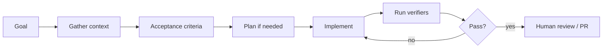
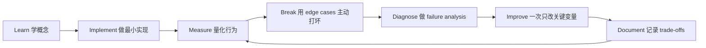

# Engineering with Coding Agents：使用编程智能体

[English version](../en/11-coding-agents.md)



真正会 Coding Agent，不是：

> “让 AI 帮我写代码。”

而是：

> **Delegate work with sufficient context, constraints, and verifiers.**

## Good Task Packet

给 agent 的任务至少包括：

- goal；
- relevant context；
- non-goals；
- architecture constraints；
- interfaces；
- acceptance criteria；
- verification commands。

低质量：

`fix auth`

高质量：

```text
Goal:
Fix refresh-token expiration handling.

Constraints:
- Do not change the public API.
- Preserve the current DB schema.

Verification:
- unit tests
- type checker
- integration tests
```

## Planning

大型 ambiguous change 可以：

`explore → plan → review → implement`

小任务不要强制长篇 planning，否则会增加 latency 和 token cost。

## Verifiers

最有价值的 agent loop：

`change → compiler/test/lint/eval → fail → self-repair → repeat`

Verifier 包括：

- compiler；
- unit tests；
- type checker；
- lint；
- integration tests；
- benchmark；
- AI eval。

## Safety

- branch；
- sandbox；
- least privilege；
- no production secrets；
- destructive actions require approval。

## 量化 Agent Productivity

跟踪：

- completion time；
- token/tool cost；
- defects；
- human interventions。

**“It felt faster” is not a measurement.**

## Practice

选一个真实 repo，用固定 workflow 完成：

- feature；
- refactor；
- bug fix；
- tests。

然后沉淀自己的 `AGENTS.md` / coding-agent instructions。

## 如何学习本章

不要采用“看完课程 = 学会了”的方式。使用下面这个工程闭环：



判断本章是否学完，不是看你是否“听说过”术语，而是看你能否 **build it, measure it, debug it, and explain the trade-offs**。中文学习过程中务必保留常见英文表达，因为真实代码库、设计文档、面试和工程讨论通常直接使用这些术语。
---

[← Software Engineering Foundations：软件工程底座](10-software-engineering-foundations.md)  ·  [Shaping the Build：产品判断与工程决策 →](12-shaping-the-build.md)
