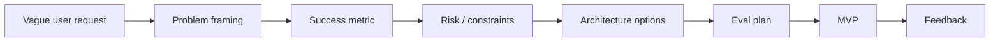
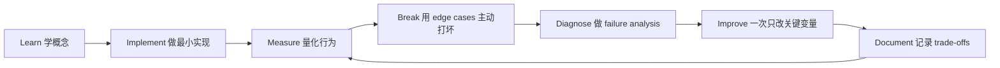

# Shaping the Build：产品判断与工程决策

[English version](../en/12-shaping-the-build.md)

这是很多工程师最容易忽略、但随着 AI coding 越来越强会越来越重要的能力。

## Problem Framing

用户说：

> “Build an AI chatbot.”

这并不是 specification。

需要继续拆：

- What job is the user trying to get done?
- What is painful in the current workflow?
- What is the measurable outcome?
- What does a failure cost?

## AI Use-Case Selection

好的 AI use case 一般有：

- describable input/output；
- measurable feedback；
- manageable failure mode；
- clear business value。

需要谨慎：

- irreversible action；
- high-stakes decision；
- 没有 verification channel；
- objective 本身不清楚。

## AI Feature Spec

至少写清：

- goal；
- inputs / outputs；
- latency / cost；
- privacy / security；
- quality / eval criteria；
- failure behavior；
- human escalation；
- non-goals。

## MVP Judgment

低风险 discovery：move fast。

涉及 money、production mutation、privacy、security、compliance、irreversible actions：slow down。

## Product Metrics

不要只看 model accuracy。

还要看：

- task completion；
- time saved；
- correction rate；
- escalation；
- acceptance；
- cost per successful outcome。

## ADR

重大 decision 写 Architecture Decision Record：

`Context → Options → Trade-offs → Decision → Risks → Revisit trigger`

这是非常典型的 senior engineering signal。

## 如何学习本章

不要采用“看完课程 = 学会了”的方式。使用下面这个工程闭环：

判断本章是否学完，不是看你是否“听说过”术语，而是看你能否 **build it, measure it, debug it, and explain the trade-offs**。中文学习过程中务必保留常见英文表达，因为真实代码库、设计文档、面试和工程讨论通常直接使用这些术语。
---

[← Engineering with Coding Agents：使用编程智能体](11-coding-agents.md)  ·  [AI Security & Safety Engineering：AI 安全工程 →](13-ai-security-safety.md)
