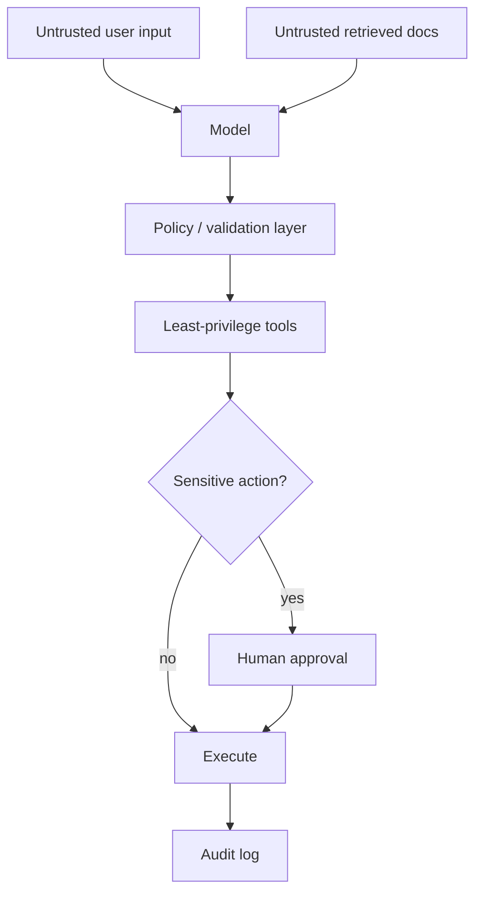
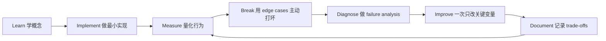

# AI Security & Safety Engineering：AI 安全工程

[English version](../en/13-ai-security-safety.md)

## Threat Model

AI system 同时拥有传统 software risks 和 model-specific attack surface：

- prompt injection；
- indirect prompt injection；
- data exfiltration；
- tool abuse；
- privilege escalation；
- unsafe code execution；
- SSRF；
- SQL injection；
- cross-tenant leakage；
- secret exposure。

## 最重要原则

> **Treat model output as untrusted data, not as trusted executable instruction.**

这句话应该成为 architecture 默认假设。

## Least Privilege

Tool 只暴露当前 task 真正需要的：

- action；
- fields；
- scope；
- permissions。

不要给 agent 一个“万能管理员 API”。

## Sandboxing

以下 capability 风险很高：

- shell；
- browser automation；
- arbitrary code execution。

应使用 restricted environment，并控制：

- network；
- filesystem；
- CPU/memory/time；
- credentials。

## Approval Gates

不可逆或高影响 action：

`model proposes → human reviews → approve/reject → execute`

例如：

- send external email；
- deploy production；
- delete resource；
- transfer funds；
- modify privileged configuration。

## Retrieval Security

**ACL must be enforced before data reaches the model.**

不能依赖模型自己“记得不要展示没权限的数据”。

## Logging / Privacy

明确：

- prompt retention；
- retrieved documents；
- tool results；
- model outputs；
- PII / secrets redaction。

## Security Evals

Eval dataset 中增加：

- injection；
- privilege bypass；
- malicious documents；
- hidden instructions；
- unauthorized tool calls。

Security 不能只做一次 threat model；它也需要 regression testing。

## 如何学习本章

不要采用“看完课程 = 学会了”的方式。使用下面这个工程闭环：

判断本章是否学完，不是看你是否“听说过”术语，而是看你能否 **build it, measure it, debug it, and explain the trade-offs**。中文学习过程中务必保留常见英文表达，因为真实代码库、设计文档、面试和工程讨论通常直接使用这些术语。
---

[← Shaping the Build：产品判断与工程决策](12-shaping-the-build.md)  ·  [24 周执行路线 →](14-24-week-plan.md)
