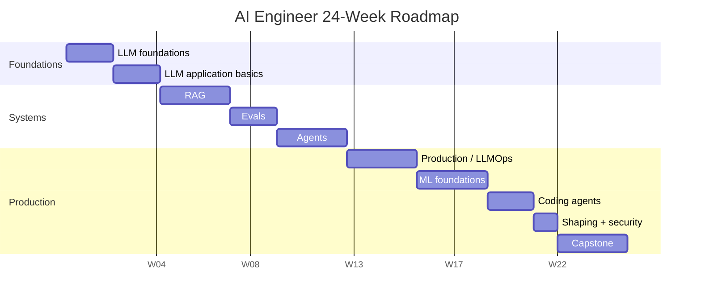
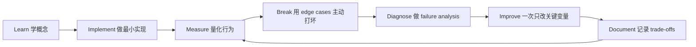

# 24 周 AI Engineer 执行路线

[English version](../en/14-24-week-plan.md)

图中的日期只是为了让 GitHub Mermaid Gantt 正常渲染，真正执行按 Week 1–24 顺序。

## Week 1–2 — LLM Foundations
学习 token、embedding、Transformer、generation、context。

产出：

- tokenizer experiment；
- embedding similarity experiment；
- tiny attention；
- notes。

## Week 3–4 — LLM Application Basics
学习：

- structured output；
- tool calling；
- streaming；
- async；
- retry。

项目：**Structured Extraction API**。

## Week 5–7 — RAG
学习：

- chunking；
- indexing；
- hybrid retrieval；
- reranking；
- citations；
- retrieval eval。

项目：**Knowledge Assistant**。

## Week 8–9 — Evals
学习：

- golden dataset；
- deterministic evaluator；
- LLM-as-judge；
- pairwise；
- regression suite。

把前面两个项目都接入统一 eval harness。

## Week 10–12 — Agents
学习：

- typed tools；
- state；
- bounded loop；
- HITL；
- checkpoint；
- idempotency；
- agent eval。

## Week 13–15 — Production
加入：

- deployment；
- auth；
- tracing；
- model gateway；
- cost/latency；
- fallback；
- rollout。

## Week 16–18 — ML Foundations
做 classical ML + small fine-tuning experiment。

## Week 19–20 — Coding Agents
在真实 repo 上量化：

- time；
- token/tool cost；
- defects；
- human intervention。

## Week 21 — Shaping + Security
在写代码前完成：

- product spec；
- technical spec；
- threat model；
- architecture；
- eval plan。

## Week 22–24 — Capstone
完成一个 production-grade enterprise research/data/operations copilot。

## 强制规则

每周必须产生至少一个：

- code；
- eval；
- benchmark；
- diagram；
- ADR；
- failure-analysis artifact。

“看完了一门课”不能单独算 deliverable。

## 如何学习本章

不要采用“看完课程 = 学会了”的方式。使用下面这个工程闭环：

判断本章是否学完，不是看你是否“听说过”术语，而是看你能否 **build it, measure it, debug it, and explain the trade-offs**。中文学习过程中务必保留常见英文表达，因为真实代码库、设计文档、面试和工程讨论通常直接使用这些术语。
---

[← AI Security & Safety Engineering：AI 安全工程](13-ai-security-safety.md)  ·  [Portfolio 与 Capstone Projects →](15-portfolio-projects.md)
