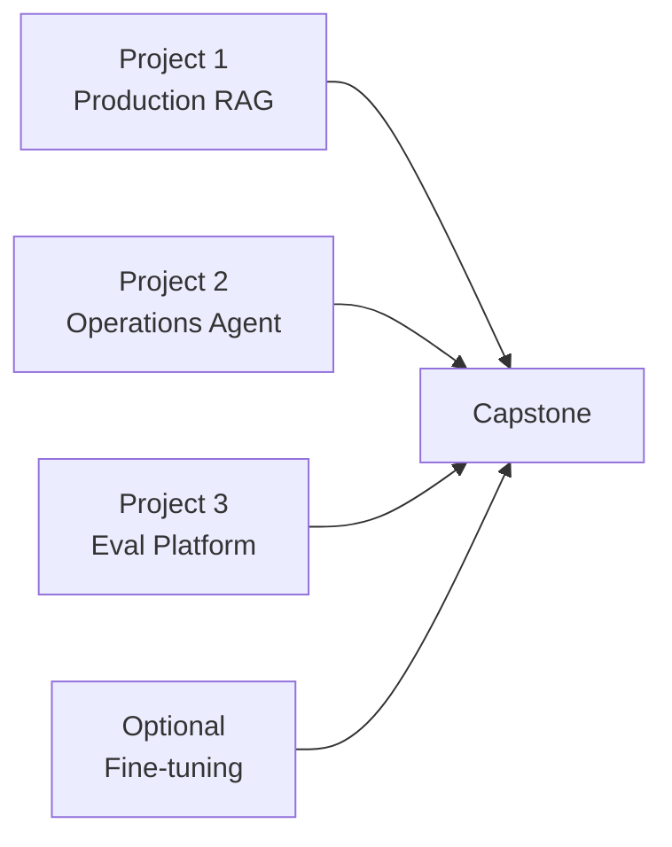
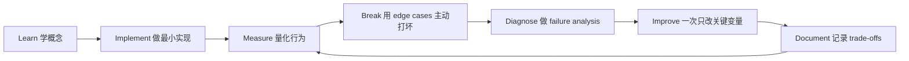

# Portfolio 与 Capstone Projects

[English version](../en/15-portfolio-projects.md)

原则：

> **3 strong projects > 15 shallow tutorial projects**

## Project 1 — Production RAG Knowledge Assistant

必须体现：

- ingestion；
- hybrid search；
- reranking；
- citations；
- ACL；
- eval；
- tracing；
- deployment。

## Project 2 — Tool-Using Operations Agent

必须有：

- typed tools；
- explicit state；
- HITL；
- idempotency；
- checkpoint；
- audit log；
- agent eval。

## Project 3 — AI Evaluation Platform

输入：

- dataset；
- model；
- prompt version。

输出：

- deterministic metrics；
- model-based grading；
- pairwise comparison；
- latency / cost；
- failure clusters。

这个项目的 engineering signal 很强，因为它证明你理解：

> **Reliable AI development is fundamentally a measurement problem.**

## Optional Project 4 — Fine-Tuning Experiment

严格比较：

`base prompt vs RAG vs fine-tuned behavior`

并用 held-out dataset 证明 fine-tuning 是否真的有意义。

## Capstone

做一个 Enterprise Research / Data / Operations Copilot：

- retrieval；
- tools；
- agent state；
- approval；
- eval；
- tracing；
- security；
- production deployment。

## README Quality Bar

每个项目 README 必须写清：

- Problem；
- Architecture；
- Why AI；
- Evaluation；
- Baseline + improvements；
- Failure Analysis；
- Production；
- Security；
- Trade-offs。

**Polished UI without evaluation evidence is weak portfolio signal.**

## 如何学习本章

不要采用“看完课程 = 学会了”的方式。使用下面这个工程闭环：

判断本章是否学完，不是看你是否“听说过”术语，而是看你能否 **build it, measure it, debug it, and explain the trade-offs**。中文学习过程中务必保留常见英文表达，因为真实代码库、设计文档、面试和工程讨论通常直接使用这些术语。
---

[← 24 周执行路线](14-24-week-plan.md)  ·  [面试与 Job-Readiness 评分标准 →](16-interview-readiness.md)
