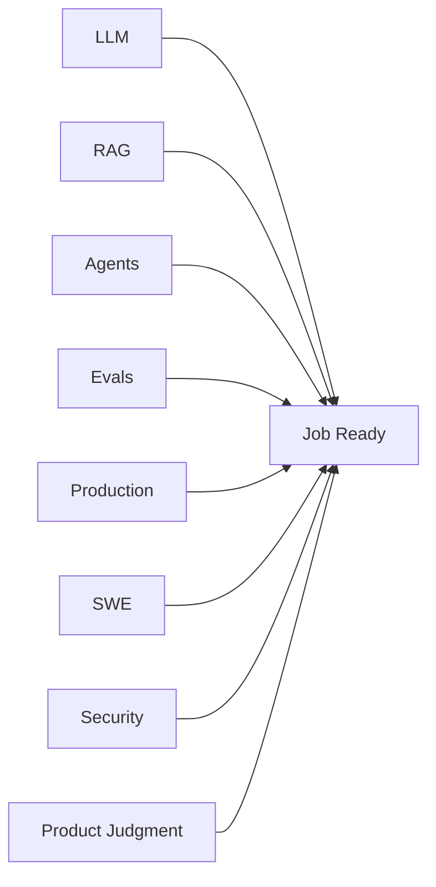
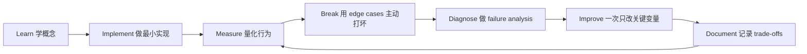

# 面试与 Job-Readiness 评分标准

[English version](../en/16-interview-readiness.md)

## 0–3 自评分

- **0** — unfamiliar；
- **1** — can explain；
- **2** — have implemented；
- **3** — can independently design, debug, and defend trade-offs。

## 核心标准

目标：

- 总体平均 > 2.3；
- P0 skill 不允许出现 0；
- Evals / Production / Software Engineering 最好 >= 2.5。

## Interview Themes

### LLM
- tokenization；
- context；
- sampling；
- model selection。

### RAG
- retrieval failure diagnosis；
- chunking；
- hybrid；
- reranking；
- retrieval eval。

### Agents
- workflow vs agent；
- loop control；
- permissions；
- HITL；
- idempotency。

### Evals
- golden dataset；
- judge calibration；
- regression。

### Production
- provider outage；
- fallback；
- latency；
- cost；
- rollout；
- drift。

### Security
- prompt injection；
- tool abuse；
- ACL；
- sandboxing。

### Product
- when not to use AI；
- acceptable failure rate；
- MVP scope。

## System Design 验收

你应该可以设计 enterprise AI assistant，并主动覆盖：

`requirements → architecture → model → retrieval → tools → state → evals → security → observability → cost/latency → rollout → feedback`

如果答案还是：

> “LLM + vector DB + framework”

继续训练。

## 如何学习本章

不要采用“看完课程 = 学会了”的方式。使用下面这个工程闭环：

判断本章是否学完，不是看你是否“听说过”术语，而是看你能否 **build it, measure it, debug it, and explain the trade-offs**。中文学习过程中务必保留常见英文表达，因为真实代码库、设计文档、面试和工程讨论通常直接使用这些术语。
---

[← Portfolio 与 Capstone Projects](15-portfolio-projects.md)  ·  [学习资源与参考资料 →](17-resources.md)
