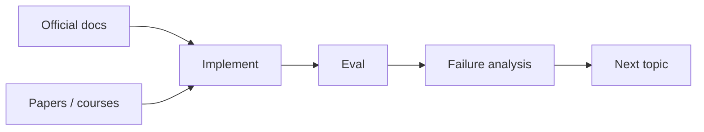

# 学习资源与参考资料

[English version](../en/17-resources.md)

## Andrew Ng / DeepLearning.AI

- https://www.andrewng.org/writing
- https://www.deeplearning.ai/the-batch/

## LLM Foundations

- Hugging Face LLM Course  
  https://huggingface.co/learn/llm-course/
- Attention Is All You Need  
  https://arxiv.org/abs/1706.03762
- PyTorch Tutorials  
  https://pytorch.org/tutorials/

## OpenAI

- Developer documentation  
  https://platform.openai.com/docs

重点不是死记某个 endpoint，而是理解：

- model API；
- structured output；
- tools / agents；
- embeddings；
- evals；
- fine-tuning。

**APIs change; concepts last longer.**

## Anthropic

- https://docs.anthropic.com/

重点：

- tool use；
- context engineering；
- agent patterns；
- coding-agent workflow。

## Agent Orchestration

- LangChain / LangGraph  
  https://docs.langchain.com/

建议：先手写 minimal agent loop，再用 framework 重构。否则你很难真正知道 framework 替你做了什么。

## Full Stack Deep Learning

- https://fullstackdeeplearning.com/

非常适合补 production ML/LLM system thinking。

## Security

- OWASP GenAI / LLM security guidance  
  https://owasp.org/

## 最重要的学习规则

优先：

`concept → official docs → minimal implementation → real project → eval → error analysis`

不要：

`course → course → course → course`
---

[← 面试与 Job-Readiness 评分标准](16-interview-readiness.md)  ·  [AI Engineering 术语与常用英文表达 →](18-glossary.md)
