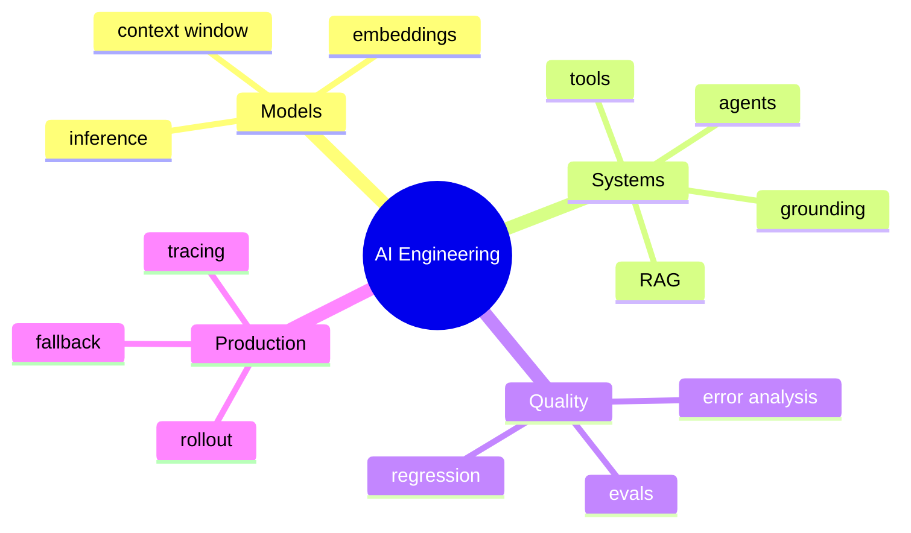

# AI Engineering 术语与常用英文表达

[English version](../en/18-glossary.md)

这份文档故意保留大量英文，因为这些词在实际 engineering team、design doc、PR、interview 中通常不会翻译。

## 常见专业词

**Grounding**  
给模型提供外部 evidence / state，使输出建立在当前可信信息上。不要硬翻成“接地”。

**Retrieval-Augmented Generation (RAG)**  
行业通常直接说 RAG。

**Tool calling / function calling**  
模型产生 structured request，由 application 实际执行外部 capability。

**Human-in-the-loop (HITL)**  
human 对 model action 做 review / approval / correction。

**Evaluation-driven development**  
把 target behavior + eval 当成 development loop 核心。

**Error analysis**  
把 failure 分类，找到最高 leverage 的 subsystem。

**Faithfulness / groundedness**  
回答是否真正被 evidence 支撑。

**Least privilege**  
只给完成 task 所需的最小权限。

**Blast radius**  
一个 failure / compromised component 最大可能影响范围。

**Canary rollout**  
先给少量 traffic，再逐步扩大。

**Fallback**  
首选 model/tool/service 不可用、不可靠或不安全时的替代路径。

## 工程里非常常用的表达

建议直接练到可以自然说出来：

- **“Let’s establish a baseline first.”**  
  先建立 baseline，再谈优化。

- **“We need to separate retrieval errors from generation errors.”**  
  必须把 retrieval 和 generation failure 分开。

- **“What is the failure mode?”**  
  failure mode 是什么？

- **“What is the blast radius?”**  
  出错最大影响范围多大？

- **“This needs a human approval gate.”**  
  这个动作需要 human approval。

- **“We should make this operation idempotent.”**  
  这个 operation 应该保证 idempotency。

- **“Can we bound the agent’s tool permissions?”**  
  能否限制 agent tool permissions？

- **“What does the held-out eval say?”**  
  held-out eval 的结果是什么？

- **“This improved quality, but the latency trade-off is not acceptable.”**  
  quality 提升了，但 latency trade-off 不值得。

- **“Let’s add this production failure to the regression set.”**

- **“We should prefer a deterministic workflow here.”**

- **“The model output should be treated as untrusted input.”**

- **“What is the cost per successful task?”**

- **“How do we roll this back?”**

- **“What would make us revisit this architecture decision?”**
---

[← 学习资源与参考资料](17-resources.md)  
