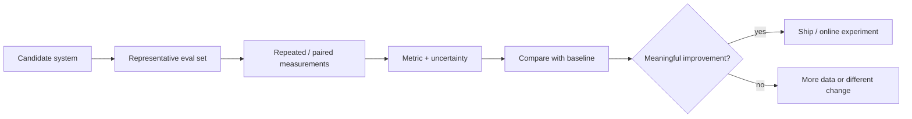

# Statistics for AI Evals and Experimentation：AI 评估与实验中的统计方法

[English version](../en/19-statistics-for-evals-experimentation.md)

Andrew Ng 的原始框架特别强调，要使用 **statistical techniques to measure, steer, and govern AI systems**。现有 Eval 章节已经覆盖 golden dataset、LLM-as-judge、error analysis 等，但如果要达到真正 production-level，还需要补上 statistical reasoning。

## 为什么这一章重要

单独说：

> `accuracy = 83%`

信息是不完整的。

你还应该知道：

- sample size 是多少？
- uncertainty 有多大？
- 这个 test set 是否 representative？
- A/B 两个版本是不是在同一批 examples 上比较？
- 结果是否可能只是 noise？



## 1. Sampling 与 Representativeness

Eval set 本质上是你关心的真实 task distribution 的一个 sample。

需要主动问：

- What population is this eval intended to represent?
- 常见 case 是否占比过高？
- 高风险但低频的 failure 是否被漏掉？
- production traffic 是否存在 benchmark 没覆盖的 segment？
- examples 是否大量 near-duplicate？
- test set 是否在 prompt/model tuning 过程中被反复看过，导致 contamination？

重要场景应该做 **stratified evaluation**，例如按：

- language；
- document type；
- task complexity；
- customer tier；
- safety category；
- agent tool path。

## 2. Point Estimate 不够

对核心 metric，尽量同时报告：

- point estimate；
- sample size `n`；
- confidence interval / uncertainty estimate；
- segment breakdown。

工程里很常见的一句话：

> **The point estimate improved, but the confidence interval is still too wide to call this a reliable win.**

## 3. Paired Comparison

比较 prompt/model/system A 和 B 时，尽可能让两个版本跑在**同一批 examples** 上。

这样可以控制 example difficulty。

至少记录：

- A wins；
- B wins；
- ties；
- previously-passing cases that regressed；
- previously-failing cases that improved。

不要只问：

> Which version has a higher average score?

还应该问：

> **Where did behavior change, and are regressions concentrated in an important segment?**

## 4. Repeated Runs 与 Model Variance

LLM 尤其是 agentic workflow，可能存在明显 run-to-run variance。

对于 stochastic task：

1. 同一个 case 跑多次；
2. 统计 success-rate variance；
3. 区分 deterministic pipeline bug 和 model variance；
4. 必要时使用 repeated-success / pass@k 类指标。

不要用一次幸运结果掩盖 instability。

## 5. Bootstrap

当 metric 的 analytic distribution 不方便计算时，bootstrap 非常实用。

直觉：

```text
original eval set
→ repeatedly sample with replacement
→ recompute metric each time
→ obtain a distribution of metric / delta
→ estimate confidence interval
```

建议自己写一个简单 bootstrap utility。

它可以用于：

- quality delta；
- cost per task；
- latency；
- composite metric。

## 6. Statistical Significance vs Practical Significance

统计上能检测到变化，不代表 product 上值得上线。

最终 release criterion 可以写成：

```text
Ship only if:
quality delta >= minimum useful improvement
AND cost <= budget
AND p95 latency <= SLA
AND critical safety regression == 0
```

非常常见的工程表达：

> **This is statistically detectable, but the effect size is too small to justify the added cost and latency.**

## 7. Human 与 LLM Judge Agreement

如果使用 LLM-as-judge，你必须 **evaluate the evaluator**。

与 human-labeled ground truth 对比：

- agreement rate；
- confusion matrix；
- precision / recall on important failure labels；
- ordinal score 的 rank correlation；
- multiple human raters 时的 inter-rater agreement。

不能因为 judge model 很强，就默认它可靠。

## 8. Threshold Calibration

很多 AI system 依赖 thresholds：

- retrieval similarity threshold；
- confidence threshold；
- automatic action vs escalation；
- judge pass threshold；
- anomaly detection threshold。

threshold 应通过真实 false-positive / false-negative cost 校准，而不是“看起来 0.8 比较合理”。

## 9. A/B Testing 与 Online Experiment

Offline eval 回答：

> controlled dataset 上是不是更好？

Online experiment 回答：

> 对真实 users 是否真的产生价值？

上线前定义：

- primary metric；
- guardrail metrics；
- target population；
- randomization unit；
- minimum detectable effect；
- stopping rule；
- rollback condition。

不要反复 peek noisy results，然后一看到 favorable result 就停止实验。

## 10. Cost / Latency 也需要 Distribution

AI system 的 latency/cost 会随：

- input length；
- output length；
- tool calls；
- agent steps；
- retry path；

变化。

所以不要只报告 average。

至少看：

- p50 / p95 / p99 latency；
- tokens per task distribution；
- cost per successful task；
- tool calls / agent steps distribution。

## Hands-on Exercise

拿一个至少 100-case 的 eval，比较 system A / B。

输出：

1. paired per-example results；
2. overall metric delta；
3. bootstrap 95% CI；
4. segment breakdown；
5. regression list；
6. quality/cost/latency decision table；
7. 最终 **ship / do-not-ship recommendation**。

## Definition of Done

你能够：

- 识别 sampling bias / test contamination；
- 报告 uncertainty，而不是只有 point estimate；
- 做 paired comparison；
- bootstrap metric delta；
- 测 stochastic variance；
- calibrate LLM judge against humans；
- 区分 statistical significance 与 practical significance；
- 设计 basic A/B test；
- 用数据 defend a release decision。

---

[← AI Engineering 术语与常用英文表达](18-glossary.md) · [AI Data Engineering →](20-ai-data-engineering.md)
