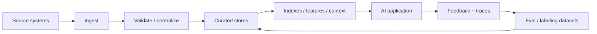
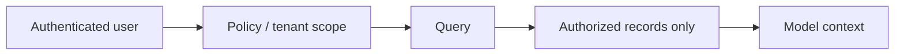

# AI Data Engineering and Feedback Loops：AI 数据工程与反馈闭环

[English version](../en/20-ai-data-engineering.md)

**Grounding models with data** 远远不等于“把 PDF 做 embeddings”。Production AI system 真正依赖的是一套能够保证 data **available, fresh, permission-aware, versioned, observable, and reusable for evaluation** 的数据工程体系。

## AI Data Lifecycle



## 1. Data Sources

真实 AI application 经常同时使用：

- unstructured documents：PDF、HTML、email、wiki、tickets；
- semi-structured data：JSON、logs、events；
- relational / structured data；
- object/blob storage；
- SaaS APIs；
- user/session state；
- model/tool traces 与 feedback。

不要把 **AI data = vector embeddings**。

## 2. Ingestion Patterns

需要理解何时使用：

- batch ingestion；
- incremental sync；
- change-data capture (CDC)；
- event-driven ingestion；
- streaming；
- on-demand retrieval。

每个 source 至少定义：

- source-of-truth owner；
- update cadence；
- delete semantics；
- retry / idempotency；
- backfill strategy；
- schema/version policy。

## 3. Data Contracts

Production pipeline 最好有 explicit data contract。

例如：

```text
source
schema
required fields
timestamp semantics
PII classification
ACL / tenant fields
freshness SLO
quality checks
owner
```

非常常见的真实故障是：model/prompt 完全没变，但 upstream data schema 或内容 silently changed，结果 RAG / eval regression。

## 4. Data Quality

通用指标：

- completeness；
- validity；
- consistency；
- uniqueness；
- freshness；
- accuracy；
- coverage。

AI corpus 还要检查：

- parse quality；
- OCR quality；
- document boundaries；
- duplicate / near-duplicate；
- conflicting versions；
- missing metadata；
- language/domain imbalance。

## 5. Freshness 与 Temporal Correctness

一个回答可以“有引用、有 grounding”，但如果证据过期，仍然是错的。

建议追踪：

- source update time；
- ingestion time；
- index update time；
- effective business date；
- expiration / supersession rule。

时间敏感系统应该定义 **freshness SLO**。

常见表达：

> **The answer is grounded, but the underlying source is stale.**

## 6. Lineage / Provenance

系统应该能够回答：

> **Which source record produced this answer, chunk, feature, or eval case?**

保留 transformation lineage，才能：

- debug bad output；
- 做 source update/delete propagation；
- reproduce an eval；
- audit data usage。

## 7. ACL-aware / Tenant-aware Data

Permission boundary 必须在 data/retrieval 层 enforcement，不能让模型自己判断。



必须专门测试：

- cross-tenant access；
- permission downgrade；
- deleted access；
- stale ACL cache。

## 8. Structured Data Grounding

不是所有问题都应该 semantic search。

优先：

- SQL/API：exact structured facts；
- retrieval：unstructured knowledge；
- deterministic code：arithmetic / business rules；
- hybrid orchestration：多个 data type 混合。

例如：

```text
“What was Q2 revenue, and what did management say caused the change?”
→ SQL / financial API 取 revenue
→ document retrieval 找 management commentary
→ LLM synthesis
```

这比把所有数字都塞进 vector DB 更合理。

## 9. Feedback Data

Production interactions 可以成为非常重要的 eval/training data。

可收集：

- thumbs up/down；
- user correction/edit；
- task completion；
- escalation；
- rejected tool action；
- cited-source click；
- retry/rephrase；
- human reviewer label。

但不要把所有 click 都当 ground truth。

必须定义：

> **What does this signal actually mean?**

## 10. Trace-to-Dataset Pipeline

成熟系统会形成：

```text
production trace
→ failure detected / reported
→ redact sensitive fields
→ root-cause label
→ add to eval dataset
→ reproduce
→ fix
→ keep as regression case
```

这就是重要的 **data flywheel / feedback loop**。

## 11. Synthetic Data

Synthetic data 适合：

- edge-case expansion；
- adversarial examples；
- format variation；
- cold-start eval dataset。

风险：

- model-generated bias；
- unrealistic examples；
- distribution mismatch；
- synthetic-to-synthetic evaluation illusion。

重要 cases 应由 human 或 trusted deterministic source 校验。

## 12. Data Versioning

至少 version：

- source snapshot / sync checkpoint；
- parser；
- chunking config；
- embedding model；
- index；
- labeling policy；
- eval dataset。

否则两次“相同 eval”可能根本不是在相同 data 上运行。

## Project

为 Knowledge Assistant 做一个 **AI Data Plane**：

- 一个 structured source；
- 一个 document source；
- incremental sync；
- schema/data-quality checks；
- freshness metrics；
- ACL enforcement；
- answer-to-source lineage；
- trace-to-eval pipeline；
- reproducible dataset/index versions。

## Definition of Done

你能够：

- 设计 batch/incremental/event-driven ingestion；
- 写 data contract / freshness SLO；
- measure data quality；
- trace provenance；
- inference 前执行 ACL/tenant filtering；
- 正确选择 SQL/API vs retrieval；
- 把 production traces 转成 regression dataset；
- 解释 synthetic-data risks；
- reproduce an eval against a known data version。

---

[← AI Evals 的统计方法](19-statistics-for-evals-experimentation.md) · [Model Adaptation & Fine-Tuning →](21-model-adaptation-finetuning.md)
