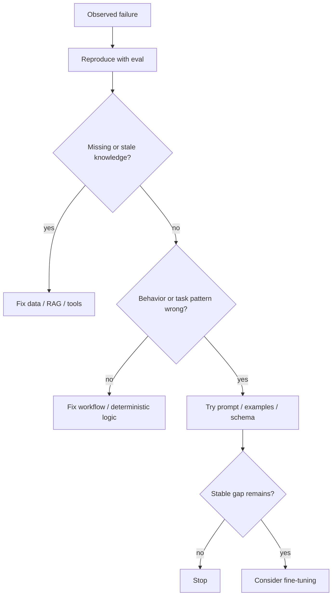

# Model Adaptation and Fine-Tuning：模型适配与微调

[English version](../en/21-model-adaptation-finetuning.md)

Fine-tuning 很有价值，但现实中经常被错误地拿来解决本质上属于 **missing context、bad retrieval、weak eval、poor tool design、workflow bug** 的问题。这一章最重要的不是背训练术语，而是建立 **when to fine-tune / when not to fine-tune** 的判断力。

## Adaptation Decision Tree



## 1. Fine-Tuning 到底改变什么

更准确地说，fine-tuning 主要是在适配 model behavior / task distribution。

适合的场景：

- consistent structured behavior；
- domain-specific classification / extraction；
- style / format conventions；
- specialized tool-use patterns；
- 减少非常长、重复的 instructions；
- prompt / RAG 修复后仍稳定存在的 narrow behavioral gap。

不应该默认这样做：

> “模型不知道公司最新 policy，所以 fine-tune 一下。”

这通常是 grounding / freshness 问题。

## 2. SFT / PEFT / LoRA / QLoRA

至少理解：

- **SFT (Supervised Fine-Tuning)**：使用 input/output demonstrations 训练；
- **PEFT**：只训练一小部分参数或 adapters；
- **LoRA**：使用 low-rank trainable adapters；
- **QLoRA**：quantized base model + LoRA-style adaptation，用更少显存训练。

Application AI Engineer 不一定要成为 training infrastructure specialist，但必须理解这些方案的 trade-offs。

## 3. Preference Optimization

概念上理解为什么除了 demonstrations，还会使用 preference data：

- preferred vs rejected outputs；
- reward-model-based methods；
- DPO-style optimization；
- reinforcement-style post-training。

关键不是背 acronym，而是能回答：

> **What supervision signal are we optimizing?**

## 4. Dataset Design

Fine-tuning 很大程度上是 data problem。

必须定义：

- task distribution；
- label/source provenance；
- deduplication；
- class/intent balance；
- edge-case coverage；
- train/validation/test split；
- leakage checks；
- PII / licensing constraints。

最终 test set 不能被拿去 training，也不要在反复选择 training examples 时泄漏。

## 5. Training 前先做 Baselines

至少建立：

1. base model baseline；
2. improved prompt baseline；
3. 如果是 knowledge problem，RAG/tool baseline；
4. 必要时 smaller/larger model comparison。

然后 fine-tune，在**同一个 held-out eval** 上比较。

非常典型的工程问题：

> **Did fine-tuning beat a strong prompt/RAG baseline, or only a weak baseline?**

## 6. Training Metric ≠ Product Metric

`loss decreased` 不代表 product improved。

### Training signals

- train/validation loss；
- learning-rate behavior；
- overfitting indicators。

### Task / Product signals

- task success；
- schema adherence；
- hallucination / factuality；
- safety；
- latency；
- cost；
- segment-level regressions。

## 7. Narrow Gain 与 Broader Regression

Fine-tuned model 可能 target task 变强，但其他能力下降。

必须同时测试：

- target task；
- nearby tasks；
- adversarial/safety cases；
- 你仍然依赖的原有能力。

不要只 evaluate 自己刚优化的 distribution。

## 8. Distillation

Distillation 可以理解为：

> 将 stronger / more expensive teacher 的行为迁移到 smaller / cheaper student。

适合：

- task distribution 比较 narrow；
- teacher outputs 可以大量生成且有办法验证；
- latency/cost 很重要；
- student 能保留足够 quality。

最终仍然看：

> **cost per successful task**

而不是单纯 model token price。

## 9. RAG + Fine-Tuning 可以同时使用

常见 production pattern：

```text
fine-tuning → behavior / format / task pattern
RAG/tools   → current facts / private state
```

它们不是 mutually exclusive，而是在解决不同问题。

## 10. Deployment / Versioning

至少 version：

- base model；
- training dataset snapshot；
- training code/config；
- adapter/checkpoint；
- tokenizer/template；
- eval dataset；
- serving config。

必须有 rollback path。

## Hands-on Project

选择 narrow task，例如 support-ticket routing / structured extraction。

比较：

1. base model；
2. prompt-engineered baseline；
3. few-shot baseline；
4. fine-tuned model。

最终报告：

- held-out quality；
- nearby-task / safety regressions；
- latency；
- inference cost；
- training cost；
- 最终回答：**Was fine-tuning actually justified?**

## Definition of Done

你能够：

- 解释什么时候 fine-tuning 是错误工具；
- 区分 SFT / PEFT / LoRA / QLoRA；
- 设计无 leakage 的 train/val/test；
- 先建立 strong baseline；
- 用 held-out data 评估 fine-tuned model；
- 识别 narrow gains + broad regressions；
- 解释 distillation；
- 正确组合 RAG + fine-tuning；
- version / rollback tuned model。

---

[← AI Data Engineering](20-ai-data-engineering.md) · [AI System Design Patterns →](22-ai-system-design-patterns.md)
