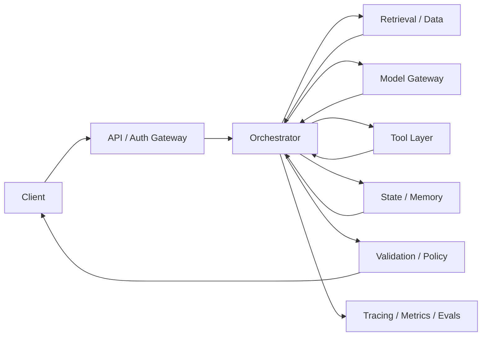
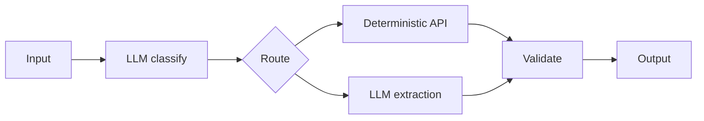
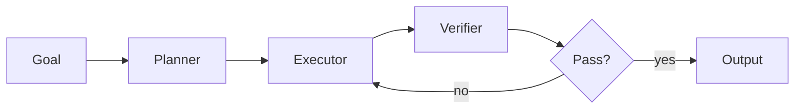

# AI System Design Patterns and Reference Architectures：AI 系统设计模式与参考架构

[English version](../en/22-ai-system-design-patterns.md)

AI system design 不是“API 前面放一个 LLM”。真正成熟的 architecture 会明确 probabilistic component 在哪里、它能做什么、它不能做什么，并用 deterministic software、data、eval、security 和 operations 把它包围起来。

## Reference Architecture



## 1. 分离 Deterministic 与 Probabilistic Logic

以下尽量使用 deterministic software：

- authorization；
- arithmetic / business rules；
- schema validation；
- irreversible action gating；
- 已知规则下的 state transition；
- exact data query。

LLM 更适合：

- semantic interpretation；
- synthesis；
- planning；
- fuzzy decision-making。

设计时经常问：

> **Why is an LLM making this decision instead of normal code?**

## 2. Model Gateway Pattern

用 stable interface 隔离 provider-specific SDK。

职责可以包括：

- model aliases；
- routing；
- timeout / retry；
- fallback；
- token/cost accounting；
- policy restrictions；
- prompt/model version metadata；
- provider normalization。

好处是减少 vendor coupling，并把 operational controls 集中在一处。

## 3. Router Pattern

Router 决定 request 走哪条路径。

例如：

```text
simple FAQ → small model
knowledge question → RAG
exact account fact → DB/API
complex open-ended task → agent
high-risk task → human workflow
```

Router 自己也需要 eval，不能只评估 downstream system。

## 4. Retrieval-then-Generate Pattern

适合 private / current knowledge。

典型阶段：

`query understanding → retrieval → reranking → context construction → generation → citation validation`

如果你需要 debug，就不要把整个 pipeline 藏成一个 black box。

## 5. Deterministic Workflow with LLM Nodes

很多所谓 agent，其实 workflow 更合适。



优点：

- predictable control flow；
- easier testing；
- lower cost；
- smaller security surface；
- easier retries/recovery。

## 6. Bounded Agent Pattern

真正无法预定义 path 时再使用 agent。

必须加 boundaries：

- allowlisted tools；
- max steps；
- token/cost budget；
- timeout；
- explicit state；
- approval gates；
- observable trajectory。

避免这种 architecture：

> **LLM while-loop + production credentials**

## 7. Planner / Executor / Verifier

复杂任务可以分工：



Verifier 能用 deterministic tests 就优先用 deterministic tests；只有 semantic criterion 才需要另一个 model judge。

## 8. Human Approval Pattern

Sensitive action：

`agent proposes → policy check → human approval → idempotent executor → audit log`

human reviewer 必须看到足够 context，而不是只给一个没有解释的 `Approve? Yes/No`。

## 9. Asynchronous Job Pattern

长时间 AI workflow 通常更适合 asynchronous job：

- job ID；
- durable queue；
- persisted state/checkpoint；
- cancellation；
- retries；
- progress event；
- dead-letter handling。

比一个 HTTP connection 等十几个 model/tool calls 更可靠。

## 10. Cache Patterns

可以 cache：

- prompt/prefix；
- embeddings；
- retrieval results；
- deterministic tool results；
- safe/repeatable response。

每个 cache 必须回答：

- key 是什么？
- TTL 多久？
- permission isolation 如何保证？
- stale data 如何 invalidation？

## 11. Memory Patterns

分清：

- request context；
- conversation state；
- workflow state；
- long-term user memory；
- knowledge base。

不要把所有 persistence 都叫 “agent memory”。很多时候就是普通 database + retrieval。

## 12. Failure Containment

明确 failure boundary：

- model failure 不应 corrupt authoritative state；
- retrieval outage 要有 fallback；
- tool timeout 不应产生 duplicate side effects；
- provider outage 要 graceful degradation；
- invalid model output 在 execution 前必须 validation。

核心问题：

> **What is the blast radius?**

## 13. Graceful Degradation

例如：

```text
primary model
→ secondary model
→ reduced-capability deterministic/RAG mode
→ human escalation
```

要明确哪些 capability 可以 degrade，哪些必须 **fail closed**。

## 14. Multi-Tenant Architecture

Enterprise system 中 tenant identity 必须贯穿：

`auth → policy → data queries → retrieval → cache keys → tools → traces`

绝不能只在 prompt 里告诉模型“不要看别的 tenant”。

## 15. Design Review Checklist

### Requirements
- user outcome 是什么？
- acceptable failure rate？
- latency/cost budget？

### Architecture
- 哪些地方 probabilistic logic 真正必要？
- agent step 能否改为 deterministic workflow？
- 什么 state 需要 durable？

### Data
- source of truth？
- freshness / ACL？

### Reliability
- model/tool/data outage 怎么办？
- side effects 是否 idempotent？

### Security
- model 最多能造成什么 action？
- blast radius？

### Quality
- component + end-to-end eval？

### Operations
- version / trace 什么？
- canary / rollback 怎么做？

## System Design Exercise

设计 enterprise support copilot：

- internal docs Q&A；
- read customer/account data；
- draft tickets/refunds；
- monetary action 需要 approval；
- thousands of users；
- prevent cross-tenant leakage。

输出：

1. architecture diagram；
2. data flow；
3. tool contracts；
4. state machine；
5. failure-mode table；
6. eval strategy；
7. security boundaries；
8. rollout plan。

## Definition of Done

你能够在 router、RAG、workflow、bounded agent、async job、human approval 等 pattern 中选择；清楚分离 deterministic/probabilistic logic；设计 failure containment；解释 state/memory；并用 quality、latency、cost、reliability、security trade-offs defend architecture。

---

[← Model Adaptation & Fine-Tuning](21-model-adaptation-finetuning.md) · [Multimodal AI Systems →](23-multimodal-ai-systems.md)
