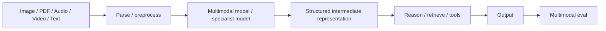

# Multimodal AI Systems：多模态 AI 系统

[English version](../en/23-multimodal-ai-systems.md)

现代 AI application 越来越多地同时处理 text、image、document、audio、video 和 structured data。Multimodal engineering 不只是“把图片传给模型”，而是涉及 modality-specific preprocessing、evaluation、latency/cost 和 failure handling。

## Multimodal Pipeline



## 1. Documents 本身就是 Multimodal

PDF 可能同时包含：

- text layer；
- tables；
- charts；
- scanned pages；
- images；
- layout；
- headers / footnotes。

纯 text parser 可能 silently destroy information。

需要判断什么时候用：

- layout-aware parser；
- OCR；
- vision model；
- table extraction；
- hybrid pipeline。

## 2. OCR / Document Extraction

OCR 必须和 downstream reasoning 分开 eval。

常见 failure：

- missed text；
- wrong characters / numbers；
- incorrect reading order；
- table cell misalignment；
- lost page/section boundaries；
- chart/image content missing。

如果 OCR 已经把证据读错，再怎么 prompt tuning 也没用。

常见表达：

> **This is an extraction failure, not a reasoning failure.**

## 3. Vision-Language Models

适合：

- image understanding；
- screenshot/UI interpretation；
- document-page reasoning；
- chart interpretation；
- visual inspection。

但 narrow task 如果 deterministic CV / specialist model 更准确、更快、更可解释，就不要为了“multimodal LLM”而强行使用大模型。

## 4. Audio / Speech

常见 pipeline：

`audio → speech-to-text → reasoning/tools → text/speech response`

也可以使用 end-to-end realtime multimodal model。

工程问题包括：

- streaming / partial transcript；
- voice activity detection；
- interruption / barge-in；
- speaker attribution；
- background noise；
- time-to-first-response；
- transcript privacy；
- TTS quality。

## 5. Video

Video 多了 temporal structure，而且 input volume 很大。

常见策略：

- sample frames；
- scene/shot detection；
- audio transcription；
- metadata extraction；
- retrieve relevant temporal segments；
- 对 selected evidence reasoning，而不是把整段 video 全塞进去。

## 6. Structured Intermediate Representation

为了 production reliability，尽可能把 multimodal input 转成 typed intermediate data。

例如 invoice：

```text
PDF/image
→ OCR/layout extraction
→ typed invoice schema
→ deterministic validation
→ business logic / LLM reasoning
```

这比整个 pipeline 全部用 opaque vision prompt 更容易测试和 debug。

## 7. Multimodal Grounding

Grounding evidence 可以来自：

- image region；
- page coordinate；
- transcript timestamp；
- table cell；
- text chunk；
- structured record。

citation 应该指向用户真正能 verification 的 evidence，例如 page、region、timestamp、source record。

## 8. Multimodal Evals

不同 modality 要有不同 eval。

### Document extraction

- field accuracy；
- numeric exactness；
- table reconstruction；
- page attribution。

### Vision QA

- object / attribute correctness；
- spatial reasoning；
- unsupported claims。

### Speech / Voice

- transcription quality；
- task completion；
- interruption handling；
- end-to-end latency。

必须同时测 intermediate stages 和 end-to-end success。

## 9. Cost / Latency

Image、long PDF、audio、video 都可能显著增加成本。

跟踪：

- preprocessing cost；
- model input size；
- inference latency；
- storage/bandwidth；
- cost per successful task。

可以使用 cascade：cheap parser/model first，只有必要时再使用 expensive multimodal reasoning。

## 10. Privacy / Safety

Multimodal data 里可能出现 text filter 看不到的 sensitive information：

- face；
- ID；
- signature；
- screenshot secrets；
- background speech；
- location metadata。

redaction / retention policy 必须覆盖每种 modality。

## Hands-on Project

做一个 **Multimodal Document Analyst**：处理 native + scanned PDF、table、chart。

要求：

- route pages to parser/OCR/vision path；
- structured intermediate data；
- page-level provenance；
- answer with page citations；
- extraction / answer quality 分开 eval；
- report latency/cost by processing path。

## Definition of Done

你能够：

- 判断 text-only processing 何时会丢信息；
- 分离 OCR/extraction failure 与 reasoning failure；
- 设计 typed intermediate representation；
- 做 document/vision/audio stage eval；
- 保留 multimodal provenance；
- 做 cost/latency/privacy trade-off。

---

[← AI System Design Patterns](22-ai-system-design-patterns.md) · [AI Governance & Model Risk →](24-ai-governance-model-risk.md)
